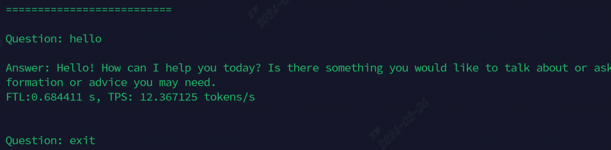

# 介绍

本项目实现算能BM1684X芯片部署各类开源`生成式AI模型`，其中以LLM为主。通过[TPU-MLIR](https://github.com/sophgo/tpu-mlir)编译器将模型转换成bmodel，并采用c++代码将其部署到PCIE环境或者SoC环境。在知乎上写了一篇解读，以`ChatGLM2-6B`为例，方便大家理解源码：[ChatGLM2流程解析与TPU-MLIR部署](https://zhuanlan.zhihu.com/p/641975976)

我们已经部署过的开源模型如下（按照首字母顺序排列）：

|Model                |INT4                |INT8                |FP16/BF16           |Huggingface Link                                                          |
|:-                   |:-                  |:-                  |:-                  |:-                                                                        |
|Baichuan2-7B         |                    |:white\_check\_mark:|                    |[LINK](https://huggingface.co/baichuan-inc/Baichuan2-7B-Chat)             |
|ChatGLM3-6B          |:white\_check\_mark:|:white\_check\_mark:|:white\_check\_mark:|[LINK](https://huggingface.co/THUDM/chatglm3-6b)                          |
|CodeFuse-7B          |:white\_check\_mark:|:white\_check\_mark:|                    |[LINK](https://huggingface.co/codefuse-ai/CodeFuse-DevOps-Model-7B-Chat)  |
|DeepSeek-6.7B        |:white\_check\_mark:|:white\_check\_mark:|                    |[LINK](https://huggingface.co/deepseek-ai/deepseek-coder-6.7b-instruct)   |
|Falcon-40B           |                    |:white\_check\_mark:|:white\_check\_mark:|[LINK](https://huggingface.co/tiiuae/falcon-40b)                          |
|Qwen-7B              |:white\_check\_mark:|:white\_check\_mark:|:white\_check\_mark:|[LINK](https://huggingface.co/Qwen/Qwen-7B-Chat)                          |
|Qwen-14B             |:white\_check\_mark:|:white\_check\_mark:|:white\_check\_mark:|[LINK](https://huggingface.co/Qwen/Qwen-14B-Chat)                         |
|Qwen-72B             |:white\_check\_mark:|                    |                    |[LINK](https://huggingface.co/Qwen/Qwen-72B-Chat)                         |
|Qwen1.5-0.5B         |:white\_check\_mark:|:white\_check\_mark:|:white\_check\_mark:|[LINK](https://huggingface.co/Qwen/Qwen1.5-0.5B-Chat)                     |
|Qwen1.5-1.8B         |:white\_check\_mark:|:white\_check\_mark:|:white\_check\_mark:|[LINK](https://huggingface.co/Qwen/Qwen1.5-1.8B-Chat)                     |
|Llama2-7B            |:white\_check\_mark:|:white\_check\_mark:|:white\_check\_mark:|[LINK](https://huggingface.co/meta-llama/Llama-2-7b-chat-hf)              |
|Llama2-13B           |:white\_check\_mark:|:white\_check\_mark:|:white\_check\_mark:|[LINK](https://huggingface.co/meta-llama/Llama-2-13b-chat-hf)             |
|LWM-Text-Chat        |:white\_check\_mark:|:white\_check\_mark:|:white\_check\_mark:|[LINK](https://huggingface.co/LargeWorldModel/LWM-Text-Chat-1M)           |
|Mistral-7B-Instruct  |:white\_check\_mark:|:white\_check\_mark:|                    |[LINK](https://huggingface.co/mistralai/Mistral-7B-Instruct-v0.2)         |
|Stable Diffusion     |                    |                    |:white\_check\_mark:|[LINK](https://huggingface.co/runwayml/stable-diffusion-v1-5)             |
|Stable Diffusion XL  |                    |                    |:white\_check\_mark:|[LINK](https://huggingface.co/stabilityai/stable-diffusion-xl-base-1.0)   |
|WizardCoder-15B      |:white\_check\_mark:|                    |                    |[LINK](https://huggingface.co/WizardLM/WizardCoder-15B-V1.0)              |
|Yi-6B                |:white\_check\_mark:|:white\_check\_mark:|                    |[LINK](https://huggingface.co/01-ai/Yi-6B-Chat)                           |

如果您想要知道转换细节和源码，可以到本项目[models](./models)子目录查看各类模型部署细节。

如果您想看看演示效果，可以根据`Quick Start`内容操作即可。

如果您对我们的芯片感兴趣，也可以通过官网[SOPHGO](https://www.sophgo.com/)联系我们。

# Quick Start

如果您手上有1684X芯片的SoC板卡或者PCIE板卡，例如Airbox（SoC），那么可以参考以下步骤跑通大语言模型，这里以Llama2-7B为例。

另外SoC的执行步骤和PCIE的有些区别，PCIE必须要安装docker后才能运行，这里将其分开说明。

## 版本检查

在开始之前，首先要检查sophon-driver的版本是否符合条件

### SoC如何执行版本检查
```
uname -v
```
之后，会显示类似这样的一个时间`#2 SMP Sat Nov 18 10:07:36 HKT 2023`，如果你的日期>=20240110，也就是比较新，那么跳过这一步，如果日期<20240110，也就是版本比较老，那么参考[这个链接](https://doc.sophgo.com/sdk-docs/v23.09.01-lts/docs_latest_release/docs/SophonSDK_doc/zh/html/sdk_intro/5_update.html#soc)重新安装sdk，刷机包则用以下命令获取
```
pip3 install dfss
python3 -m dfss --url=open@sophgo.com:/ext_model_information/LLM/LLM-TPU/sdcard.tgz
```

### PCIE如何执行版本检查
```
cat /proc/bmsophon/driver_version
```
之后，会显示类似这样的一个release date`release version:0.5.0   release date: 20240304-175610`，如果你的日期>=20240110，也就是比较新，那么跳过这一步，如果日期<20240110，也就是版本比较老，那么按照如下步骤重新安装driver
```
pip3 install dfss
python3 -m dfss --url=open@sophgo.com:/ext_model_information/LLM/LLM-TPU/sophon-driver_0.5.0_amd64.deb
python3 -m dfss --url=open@sophgo.com:/ext_model_information/LLM/LLM-TPU/sophon-libsophon-dev_0.5.0_amd64.deb
python3 -m dfss --url=open@sophgo.com:/ext_model_information/LLM/LLM-TPU/sophon-libsophon_0.5.0_amd64.deb

sudo apt remove sophon-driver sophon-libsophon
sudo dpkg -i sophon-*.deb
```

## 跑通Demo

### SoC如何跑通Demo

#### 1. 克隆LLM-TPU项目，并执行run.sh脚本
```
git clone https://github.com/sophgo/LLM-TPU.git
./run.sh --model llama2-7b
```

### PCIE如何跑通Demo

#### 1. 安装docker，并进入docker
```
docker pull sophgo/tpuc_dev:latest
docker run --privileged --name mlir -v /dev:/dev -v $PWD:/workspace -it sophgo/tpuc_dev:latest bash
docker exec -it mlir bash
```

#### 2. 克隆LLM-TPU项目，并执行run.sh脚本
```
git clone https://github.com/sophgo/LLM-TPU.git
./run.sh --model llama2-7b
```

### 效果图
跑通后效果如下图所示



### Command Table

目前用于演示的模型，全部命令如下表所示

| Model           | SoC                                         | PCIE                                         |
| :-------------- | :------------------------------------------ | :------------------------------------------- |
| ChatGLM3-6B     | ./run.sh --model chatglm3-6b --arch soc     | ./run.sh --model chatglm3-6b --arch pcie     |
| Llama2-7B       | ./run.sh --model llama2-7b --arch soc       | ./run.sh --model llama2-7b   --arch pcie     |
| Qwen-7B         | ./run.sh --model qwen-7b --arch soc         | ./run.sh --model qwen-7b     --arch pcie     |
| LWM-Text-Chat   | ./run.sh --model lwm-text-chat --arch soc   | ./run.sh --model lwm-text-chat  --arch pcie  |
| WizardCoder-15B | ./run.sh --model wizardcoder-15b --arch soc | ./run.sh --model wizardcoder-15b --arch pcie |


# 常见问题

### Q1：如果我的BM1684X环境没有联网，那么怎么跑通大语言模型？

A：您可以先在联网的大机器上git clone本项目，之后运行 ./run.sh --model llama2-7b

然后把LLM-TPU的全部文件拷贝到Airbox上，必须要是全部文件，包括LLM-TPU/models和LLM-TPU/deploy

最后再在Airbox上运行 ./run.sh --model llama2-7b

### Q2：为什么在PCIE模式下，我在docker里运行以后第一次输出会出现如下的warning？
Warning 部分：

[a53lite_runtime][error] open file /opt/sophon/libsophon-current/lib/tpu_module/libbm1684x_kernel_module.so error!!

[a53lite_runtime][error] /workspace/libsophon/bmlib/src/a53lite_api.cpp 488: load file failed!
bm_module is null!

A：这是由于docker内部本身不具有libsophon导致的，解决方法为
```
pip3 install dfss
python3 -m dfss --url=open@sophgo.com:/ext_model_information/LLM/LLM-TPU/sophon-driver_0.5.0_amd64.deb
python3 -m dfss --url=open@sophgo.com:/ext_model_information/LLM/LLM-TPU/sophon-libsophon-dev_0.5.0_amd64.deb
python3 -m dfss --url=open@sophgo.com:/ext_model_information/LLM/LLM-TPU/sophon-libsophon_0.5.0_amd64.deb

sudo dpkg -i sophon-*.deb
source /etc/profile
```
完成上述步骤后，下次推理时此类warning将不会出现。

### Q3：推理出来精度异常，输出全是“！”

A：可能是由于板子的tpu电压太低了，tpu降频就好了，降频命令如下
```
echo "setr tpll_clock 750000000" > /sys/kernel/debug/top/clock
echo "setr mpll_clock 1800000000" > /sys/kernel/debug/top/clock
echo "setr vpll_clock 100000000"> /sys/kernel/debug/top/clock
```


