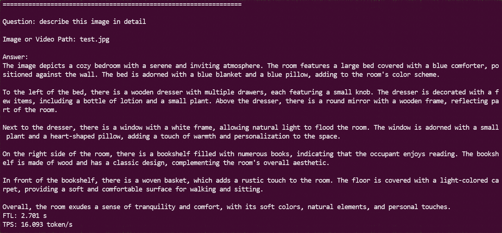

<p align="center">
    <a href=""></a>
    <a href=""></a>
    <a href="https://github.com/sophgo/LLM-TPU/graphs/contributors"></a>
    <a href="https://github.com/sophgo/LLM-TPU/issues"></a>
    <a href="https://github.com/sophgo/LLM-TPU/commits"></a>
</p>
<p align="center">
    <a href="https://github.com/sophgo/LLM-TPU/forks"></a>
    <a href="https://github.com/sophgo/LLM-TPU/stargazers"></a>
</p>


# 最近更新！ 🔥🔥🔥

- **2025.10.15**：🚀 **Qwen3VL** BM1684X/1688已支持，详情见[Qwen3VL](./models/Qwen3_VL/)。支持图片和视频。
- **2025.05.22**：🚀 **InternVL3** BM1684X/1688已支持，详情见[InternVL3](./models/InternVL3/)。支持图片和视频。
- **2025.04.30**：🚀 **Qwen2.5VL** BM1684X/1688已支持，详情见[Qwen2.5VL](./models/Qwen2_5_VL/)。其中demo有python和c++两个版本，且都支持图片和视频。
- **2025.04.29**：🚀 Qwen最新推理模型**Qwen3**，BM1684X/1688已支持，详情见[Qwen3 Demo](./models/Qwen3/)。
- **2025.03.07**：🚀 Qwen最新推理模型**QWQ-32B**和**DeepSeek-R1-Distill-Qwen-32B**，1684x多芯demo已适配，详情见[Qwen2.5 Demo](./models/Qwen2_5/)。
- **2025.02.05**：🚀 DeepSeek时刻！！我们适配了**DeepSeek-R1-Distill-Qwen**系列模型，包括1.5B、7B和14B版本，详情见[Qwen2.5 Demo](./models/Qwen2_5/)。


# 目录
  - [介绍](#介绍)
  - [快速开始](#快速开始)
  - [LLM编译方法](#LLM编译方法)
  - [进阶应用](#进阶应用)
  - [精度优化](#精度优化)
  - [常见问题](#常见问题)
  - [资料链接](#资料链接)


# 介绍

本项目实现算能BM1684X、BM1688(CV186X)芯片部署各类开源`生成式AI模型`，其中以LLM/VLM为主。通过[TPU-MLIR](https://github.com/sophgo/tpu-mlir)编译器将模型转换成bmodel，再基于tpu-runtime的推理引擎接口，采用python/c++代码将其部署到PCIE环境或者SoC环境。

如果要编译模型，需要配置[TPU-MLIR](https://github.com/sophgo/tpu-mlir)环境，包括安装docker和编译源码；
也可以直接用各类Demo中编译好的bmodel。

各个模型的Demo见此目录[models](./models)。

# 快速开始

克隆LLM-TPU项目，并执行run.sh脚本
```shell
git clone https://github.com/sophgo/LLM-TPU.git
./run.sh --model qwen2.5vl
```

详细请参考[Quick Start](./docs/Quick_Start.md), 跑通后效果如下图所示:




## Command Table

目前用于演示的模型如下:

| Model           | Command                           |
| :-------------- | :-------------------------------- |
| Qwen3-4B        | ./run.sh --model qwen3            |
| Qwen2.5-VL-3B   | ./run.sh --model qwen2.5vl        |
| InternVL3-2B    | ./run.sh --model internvl3        |

# LLM编译方法

以`Qwen2.5-VL`为例介绍模型编译方法。

## 1.下载权重
下载LLM模型，注意优先使用AWQ或者GPTQ模型，如下：

```shell
git lfs install
git clone git@hf.co:Qwen/Qwen2.5-VL-3B-Instruct-AWQ
```
## 2.配置TPU-MLIR

MLIR环境支持多种安装方式，请参考：[MLIR环境安装指南](https://github.com/sophgo/LLM-TPU/blob/main/docs/Mlir_Install_Guide.md)

## 3.编译模型

编译命令如下：
```shell
llm_convert.py -m /workspace/Qwen2.5-VL-3B-Instruct-AWQ -s 2048 -q w4bf16 -c bm1684x --max_pixels 672,896 -o qwen2.5vl_3b
```

`llm_convert.py` 是一个通用的llm模型导出工具，能够直接将llm原始权重直接导出为bmodel。

支持的主要参数如下:

| **参数名**     | **简写** | 必选？ | **说明**            |
| ------------- | -------- | ----- | ------------------- |
| model_path    |  m       | 是    | 指定权重路径        |
| seq_length    |  s       | 是    | 指定序列最大长度    |
| quantize      |  q       | 是    | 指定量化类型, w4bf16/w4f16/bf16/f16等等 |
| chip          |  c       | 是    | 指定平台, 如bm1684x/bm1688/cv186x |
| q_group_size  |  g       | 否    | 指定每组量化的组大小, 默认64 |
| max_pixels    |  -       | 否    | qwen vl参数, 指定最大图片尺寸, 可以是`672,896`,也可以是`602112`  |
| do_sample     |  -       | 否    | 指定输出是否包含采样模型，默认关闭 |
| out_dir       |  o       | 是    | 指定输出目录 |

还有更多参数可以参考[进阶应用](#进阶应用)。
其中**量化类型用w4bf16还是w4f16**，要看LLM中`config.json`配置llm的`torch_dtype`是`bfloat16`还是`float16`。

`llm_convert.py`执行完成后在指定目录会生成对应的bmodel和配置目录config。

支持一键编译的**VLM模型**包括：
* [Qwen2.5VL](https://huggingface.co/Qwen/Qwen2.5-VL-3B-Instruct-AWQ)
* [Qwen2VL](https://huggingface.co/Qwen/Qwen2-VL-2B-Instruct-AWQ)
* [InternVL3](https://huggingface.co/OpenGVLab/InternVL3-2B-AWQ)
* [Gemma3](https://huggingface.co/google/gemma-3-4b-it)

**LLM模型**包括：
* Qwen系列：Qwen1.5/Qwen2/Qwen2.5/[Qwen3](https://huggingface.co/Qwen/Qwen3-4B-AWQ)/[QwQ-32B](https://huggingface.co/Qwen/QwQ-32B-AWQ)
* Qwen相关：[DeepSeek-R1-Distill-Qwen](https://huggingface.co/deepseek-ai/DeepSeek-R1-Distill-Qwen-7B)
* Llama系列：[Llama2](https://huggingface.co/meta-llama/Llama-2-7b-chat-hf)/[Llama3](https://huggingface.co/meta-llama/Llama-3.2-3B-Instruct)
* MiniCPM系列：[MiniCPM4](https://huggingface.co/openbmb/MiniCPM4-0.5B-QAT-Int4-GPTQ-format)
* Phi系列：[Phi3](https://huggingface.co/microsoft/Phi-3-mini-4k-instruct)/[Phi4](https://huggingface.co/microsoft/Phi-4-mini-instruct)
* ChatGLM系列：[ChatGLM3](https://huggingface.co/THUDM/chatglm3-6b)

除了一键编译外，其他模型可以采用传统方法编译，先转onnx再转bmodel，具体可以参考每个模型的Demo介绍。

## 4.已部署模型

我们已经部署过的LLM模型包括:  

`Baichuan2`  
`ChatGLM3`/`ChatGLM4`/`CodeFuse`  
`DeepSeek-6.7B`/`DeepSeek-R1-Distill-Qwen`  
`Falcon`  
`Gemma`/`Gemma2`  
`Llama2`/`Llama3`/`LWM-Text-Chat`  
`MiniCPM`/`MiniCPM3`/`MiniCPM4`/`Mistral`  
`Phi-3`/`Phi-4`
`Qwen`/`Qwen1.5`/`Qwen2`/`Qwen2.5`/`QwQ-32B`/`Qwen3`  
`WizardCoder`  
`Yi`  


多模态模型包括:  
`Qwen2.5-VL`/`Qwen2-VL`/`Qwen-VL`  
`InternVL3`/`InternVL2`  
`MiniCPM-V-2_6`  
`Llama3.2-Vision`  
`Stable Diffusion`  
`Molmo`  
`OpenClip`  
`NVILA`  
`DeepSeek-Janus-Pro`  

如果您想要知道转换细节和源码，可以到本项目[models](./models)子目录查看各类模型部署细节。

如果您对我们的芯片感兴趣，也可以通过官网[SOPHGO](https://www.sophgo.com/)联系我们。

# 进阶应用

## 1. 动态编译

默认情况下模型是静态编译，输入按照指定的`seq_length`长度推理，不足部分会补0和mask掉，当输入长度变化幅度不大的时候，建议用默认方式。

动态编译可以根据输入长度动态推理，在输入长短变化幅度较大的情况下，可以减少短输入的延时。

方法：在`llm_converter.py`命令加入`--dynamic`
样例：

1) [Qwen3](./models/Qwen3)，python与cpp demo都支持
2) [Qwen2.5VL](./models/Qwen2_5_VL)，python与cpp demo都支持
3) [MiniCPM4](./models/MiniCPM4)
4) [InternVL3](./models/InternVL3)

## 2. Prefill with kv cache

默认情况下历史上下文是靠历史token与当前输入token拼凑来实现，延时较长。
采样prefill with kv cache可以减少延时。
方法：在`llm_converter.py`命令加入`--use_block_with_kv`参数；
`--max_input_length`指定单次输入最大长度，不指定时默认是seq_length的1/4；
`--max_prefill_kv_length`指定输入最大kv长度, 不指定时默认是seq_length。
样例：

1) [Qwen2.5VL](./models/Qwen2_5_VL)，python与cpp demo都支持
2) [Qwen3](./models/Qwen3)，python与cpp demo都支持
3) [InternVL3](./models/InternVL3)

## 3. 多芯推理

默认情况下推理在单芯上进行。可以采用多芯设备支持更大模型，和加速推理。
方法：在`llm_converter.py`命令加入`--num_device`参数指定芯片数量
样例：

1) [Qwen2_5/python_demo_parallel](./models/Qwen2_5/python_demo_parallel)，支持Qwen系列2/4/6/8芯推理

## 4. 随机采样

默认情况下采用greedy方式，即topk1取token。可以支持根据`generation.json`的配置进行随机采样。
方法：在`llm_converter.py`命令加入`--do_sample`
样例：

1) [Qwen3](./models/Qwen3)，python与cpp demo都支持
2) [InternVL3](./models/InternVL3) 
3) [MiniCPM4](./models/MiniCPM4)

## 5. 多任务

可以对相同模型，加载多次支持多任务；如果是对同一颗芯片，权重只会加载一次；不过不太建议单颗芯片做多任务。
样例：

1) [Qwen2.5VL/cpp_demo_multiuser](./models/Qwen2_5_VL/cpp_demo_multiuser/)

## 6. prefill共享复用

可以将较长的prompt生成kv cache，后续对话内容始终共用该kv cache。它会将模型分为三个阶段：prompt推理、prefill推理、decode推理。
如果prompt不变，则prompt推理只用进行一次。
方法：在`llm_converter.py`命令加入`--share_prompt`，并指定`--max_prefill_kv_length`
样例：

1) [Qwen2_5/python_demo_share_prompt](./models/Qwen2_5/python_demo_share_prompt)
2) [Qwen3/python_demo_share_prompt](./models/Qwen3/python_demo_share_prompt)

## 7. 模型加密

可以支持模型被第三方库加密，推理时用解密库解密

1) [Qwen/share_cache_demo](./models/Qwen/share_cache_demo)
2) [Qwen1_5/share_cache_demo](./models/Qwen1_5/share_cache_demo)

## 8. VIT动态

当实际应用图片有大有小时，为了兼顾到不同尺寸下的vit性能，可以把vit做成动态。命令加入`--dynamic_vit`即可。
样例：

1) [Qwen2.5VL](./models/Qwen2_5_VL)，python与cpp demo都支持


# 精度优化

1) 请优先用AWQ或者GPTQ模型转bmodel
2) 如果是浮点模型，如果要进一步提高W4A16的精度，请用[AutoAWQ](https://huggingface.co/docs/transformers/main/en/quantization/awq#awq)或者[AutoGPTQ](https://huggingface.co/docs/transformers/main/en/quantization/gptq)进行量化

# 常见问题

请参考[LLM-TPU常见问题及解答](./docs/FAQ.md)


# 资料链接

* [ChatGLM2流程解析与TPU-MLIR部署](https://zhuanlan.zhihu.com/p/641975976)
* [TPU-MLIR](https://github.com/sophgo/tpu-mlir)
* [TPU-MLIR快速入门手册](https://doc.sophgo.com/sdk-docs/v23.09.01-lts-sp4/docs_latest_release/docs/tpu-mlir/quick_start/html/index.html)
* [TPU-MLIR论文、整体工程讲解](https://www.bilibili.com/video/BV1My4y1o73Q)
