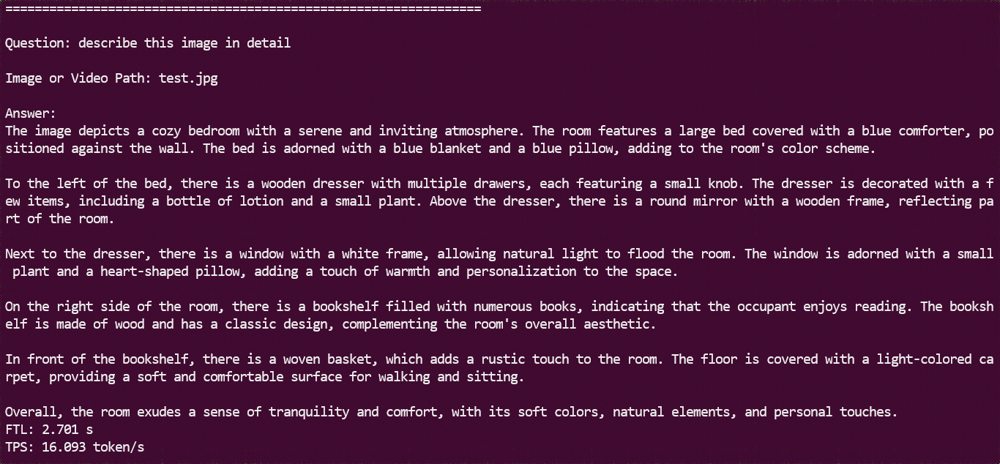

<div align="center">


# LLM-TPU

**在算能 SOPHGO TPU 上一键部署主流大语言模型与多模态模型**

*Deploy LLMs & VLMs on SOPHGO BM1684X / BM1688 / CV186X with a single command*

[](https://www.python.org/)
[]()
[](https://www.sophgo.com/)
[](./LICENSE)
[](https://github.com/sophgo/LLM-TPU/graphs/contributors)
[](https://github.com/sophgo/LLM-TPU/issues)
[](https://github.com/sophgo/LLM-TPU/stargazers)

[English](./README.md) · **简体中文**

[快速开始](#-快速开始) ·
[模型支持](#-模型支持) ·
[编译流程](#-llm-编译流程) ·
[进阶应用](#-进阶应用) ·
[FAQ](./docs/FAQ.md) ·
[官网](https://www.sophgo.com/)

</div>

---

## 📰 最新动态

| 日期 | 更新内容 |
| :--- | :--- |
| 🔥 **2026.07.16** | **Falcon-Perception** 已支持 BM1684X，Python Demo，referring segmentation（box + mask） → [查看](./models/Falcon-Perception/) |
| 🔥 **2026.07.09** | **LocateAnything-3B** 已支持 BM1684X / BM1688，Python Demo，视觉定位（box / point） → [查看](./models/LocateAnything/) |
| **2026.06.30** | **MiniCPM-V-4.6** 已支持 BM1684X / BM1688，Python Demo，支持图片与视频 → [查看](./models/MiniCPMV4_6/) |
| **2026.05.21** | **Gemma4** 已支持 BM1684X / BM1688，Python Demo，支持图片 / 视频 / 音频 → [查看](./models/Gemma4/) |
| **2026.04.15** | **Qwen3.5** 已支持 BM1684X / BM1688，提供 Python 与 C++ Demo，支持图片与视频 → [查看](./models/Qwen3_5/) |
| **2025.10.15** | **Qwen3-VL** 已支持 BM1684X / BM1688，Python / C++ Demo，支持图片与视频 → [查看](./models/Qwen3_VL/) |
| **2025.05.22** | **InternVL3** 已支持 BM1684X / BM1688，支持图片与视频 → [查看](./models/InternVL3/) |
| **2025.04.30** | **Qwen2.5-VL** 已支持 BM1684X / BM1688，Python / C++ Demo → [查看](./models/Qwen2_5_VL/) |
| **2025.04.29** | 推理模型 **Qwen3** 已支持 BM1684X / BM1688 → [查看](./models/Qwen3/) |
| **2025.03.07** | **QwQ-32B** 与 **DeepSeek-R1-Distill-Qwen-32B** 多芯 Demo 已适配 → [查看](./models/Qwen2_5/) |
| **2025.02.05** | 适配 **DeepSeek-R1-Distill-Qwen** 系列 (1.5B / 7B / 14B) → [查看](./models/Qwen2_5/) |

---

## 📖 项目介绍

**LLM-TPU** 是 [SOPHGO](https://www.sophgo.com/) 官方维护的开源项目，致力于在算能 **BM1684X / BM1688 / CV186X** 系列 TPU 芯片上部署主流的 **生成式 AI 模型**（LLM / VLM）。

```
   ┌──────────────┐    tpu-mlir    ┌──────────────┐    tpu-runtime   ┌──────────────────┐
   │  HuggingFace │ ─────────────► │   bmodel     │ ───────────────► │  PCIE / SoC 部署  │
   │   原始权重    │   llm_convert  │  (量化模型)  │    Python / C++  │  BM1684X / 1688  │
   └──────────────┘                └──────────────┘                  └──────────────────┘
```

- 🚀 **一键编译**：`llm_convert.py` 直接将 HuggingFace 权重导出为 bmodel
- 🧩 **模型丰富**：覆盖 Qwen / Llama / DeepSeek / InternVL / MiniCPM / Phi / ChatGLM 等数十种模型
- 🎯 **多模态**：支持文本、图像、视频、音频等多模态推理
- ⚡ **高效推理**：支持 AWQ/GPTQ等 量化模型、动态编译、KV Cache、多芯并行
- 🛠️ **双语言 Demo**：常用模型会提供 Python 与 C++ 参考实现
- 📦 **开箱即用**：可直接下载预编译 bmodel，无需自行编译

> 编译模型需要配置 [TPU-MLIR](https://github.com/sophgo/tpu-mlir) 环境（Docker 或源码均可），亦可直接使用各 Demo 中预编译的 bmodel。完整模型列表见 [`models/`](./models)。

---

## 🚀 快速开始

只需两步即可在 TPU 设备上跑通一个 LLM：

```bash
git clone https://github.com/sophgo/LLM-TPU.git
cd LLM-TPU
./run.sh --model qwen2.5vl
```

### 一键运行的 Demo 模型

| 模型           | 命令                              |
| :------------- | :-------------------------------- |
| Qwen3-4B       | `./run.sh --model qwen3`          |
| Qwen2.5-VL-3B  | `./run.sh --model qwen2.5vl`      |
| InternVL3-2B   | `./run.sh --model internvl3`      |


<div align="center">
  
  
</div>

---

## 🧠 模型支持

### 多模态模型 (VLM / Audio / Vision)

| 模型 | 支持芯片 | 一键编译 | 备注 |
| :--- | :---: | :---: | :--- |
| [Falcon-Perception](https://huggingface.co/tiiuae/falcon-perception) | BM1684X | — | Python，referring segmentation box + mask |
| [LocateAnything-3B](https://huggingface.co/NVIDIA/LocateAnything-3B) | BM1684X / 1688 | — | Python，视觉定位 box / point |
| [Qwen3.5](https://www.modelscope.cn/collections/Qwen/Qwen35) | BM1684X / 1688 | ✅ | Python + C++，图片 / 视频 |
| [Qwen3-VL](https://www.modelscope.cn/models/Qwen/Qwen3-VL-4B-Instruct) | BM1684X / 1688 | ✅ | Python + C++，图片 / 视频 |
| [Qwen2.5-VL](https://huggingface.co/Qwen/Qwen2.5-VL-3B-Instruct-AWQ) | BM1684X / 1688 | ✅ | Python + C++ |
| [Qwen2-VL](https://huggingface.co/Qwen/Qwen2-VL-2B-Instruct-AWQ) | BM1684X / 1688 | ✅ | — |
| [InternVL3](https://huggingface.co/OpenGVLab/InternVL3-2B-AWQ) | BM1684X / 1688 | ✅ | 支持视频 |
| [Gemma4](https://huggingface.co/google/gemma-4-E2B-it) | BM1684X / 1688 | ✅ | Python，图片 / 视频 / 音频 |
| [Gemma3](https://huggingface.co/google/gemma-3-4b-it) | BM1684X / 1688 | ✅ | — |
| Qwen-VL / InternVL2 / MiniCPM-V-2.6 / Llama3.2-Vision | BM1684X / 1688 | — | 已部署 |

### LLM 模型

| 系列 | 代表模型 | 一键编译 |
| :--- | :--- | :---: |
| **Qwen** | Qwen1.5 / Qwen2 / Qwen2.5 / [Qwen3](https://huggingface.co/Qwen/Qwen3-4B-AWQ) / [QwQ-32B](https://huggingface.co/Qwen/QwQ-32B-AWQ) | ✅ |
| **DeepSeek** | [DeepSeek-R1-Distill-Qwen](https://huggingface.co/deepseek-ai/DeepSeek-R1-Distill-Qwen-7B) (1.5B / 7B / 14B / 32B) | ✅ |
| **Llama** | [Llama2](https://huggingface.co/meta-llama/Llama-2-7b-chat-hf) / [Llama3](https://huggingface.co/meta-llama/Llama-3.2-3B-Instruct) | ✅ |
| **MiniCPM** | [MiniCPM4](https://huggingface.co/openbmb/MiniCPM4-0.5B-QAT-Int4-GPTQ-format) | ✅ |
| **Phi** | [Phi-3](https://huggingface.co/microsoft/Phi-3-mini-4k-instruct) / [Phi-4](https://huggingface.co/microsoft/Phi-4-mini-instruct) | ✅ |
| **ChatGLM** | [ChatGLM3](https://huggingface.co/THUDM/chatglm3-6b) / ChatGLM4 | ✅ |
| **其他** | Baichuan2 · CodeFuse · Falcon · Gemma / Gemma2 · Mistral · WizardCoder · Yi · Yi34B · LWM-Text-Chat · Megrez · MiniCPM3 · DeepSeek-V2 | — |

### 完整目录索引

仓库 [`models/`](./models) 下当前包含以下模型实现：

**LLM**：
[ChatGLM3](./models/ChatGLM3) ·
[Llama3](./models/Llama3) ·
[MiniCPM4](./models/MiniCPM4) ·
[Phi-3](./models/Phi-3) ·
[Qwen2_5](./models/Qwen2_5) ·
[Qwen3](./models/Qwen3)

**多模态 (Vision / Video / Audio)**：
[Falcon-Perception](./models/Falcon-Perception) ·
[Gemma3](./models/Gemma3) ·
[Gemma4](./models/Gemma4) ·
[GLM4V](./models/GLM4V) ·
[InternVL3](./models/InternVL3) ·
[Janus-Pro](./models/Janus-Pro) ·
[Llama3_2-Vision](./models/Llama3_2-Vision) ·
[LocateAnything](./models/LocateAnything) ·
[MiniCPMV4](./models/MiniCPMV4) ·
[MiniCPMV4_6](./models/MiniCPMV4_6) ·
[NVILA](./models/NVILA) ·
[Qwen2_5_Omni](./models/Qwen2_5_Omni) ·
[Qwen2_5_VL](./models/Qwen2_5_VL) ·
[Qwen2_VL](./models/Qwen2_VL) ·
[Qwen3_5](./models/Qwen3_5) ·
[Qwen3_ASR](./models/Qwen3_ASR) ·
[Qwen3_VL](./models/Qwen3_VL)

#### 历史版本 (Legacy)

使用旧版编译流程（ONNX 导出 + `model_transform.py` / `model_deploy.py`，即 `llm_convert.py` 之前的流程）构建的 Demo 已移至 [`models/legacy/`](./models/legacy)，仅作参考保留，不再积极维护：

**LLM**：[Baichuan2](./models/legacy/Baichuan2) · [ChatGLM2](./models/legacy/ChatGLM2) · [CodeFuse](./models/legacy/CodeFuse) · [DeepSeek-V2](./models/legacy/DeepSeek-V2) · [GLM4](./models/legacy/GLM4) · [Llama2](./models/legacy/Llama2) · [LWM](./models/legacy/LWM) · [Megrez](./models/legacy/Megrez) · [MiniCPM3](./models/legacy/MiniCPM3) · [Mistral](./models/legacy/Mistral) · [Qwen](./models/legacy/Qwen) · [Qwen1_5](./models/legacy/Qwen1_5) · [Qwen2](./models/legacy/Qwen2) · [RWKV6](./models/legacy/RWKV6) · [RWKV7](./models/legacy/RWKV7) · [WizardCoder](./models/legacy/WizardCoder) · [Yi](./models/legacy/Yi) · [Yi34B](./models/legacy/Yi34B)

**多模态**：[DriveMM](./models/legacy/DriveMM) · [InternVL2](./models/legacy/InternVL2) · [MiniCPM-V-2_6](./models/legacy/MiniCPM-V-2_6) · [Molmo](./models/legacy/Molmo) · [Qwen2_Audio](./models/legacy/Qwen2_Audio) · [VILA1_5](./models/legacy/VILA1_5)

完整源码与转换细节请见各子目录。

---

## 🧩 LLM 编译流程

以 `Qwen3.5-2B` 为例：

### 1. 下载权重

> 优先选择 **AWQ** / **GPTQ** / **AutoRound** 量化版本，精度更优。

```bash
git lfs install
git clone https://huggingface.co/Intel/Qwen3.5-2B-int4-AutoRound
```

### 2. 配置 TPU-MLIR

参考 [TPU-MLIR](https://github.com/sophgo/tpu-mlir)

### 3. 一键编译为 bmodel

```bash
llm_convert.py \
    -m /workspace/Qwen3.5-2B-int4-AutoRound \
    -s 2048 --max_input_length 1024 \
    -c bm1684x \
    -o qwen3.5_2b
```

#### 两种编译模式：不支持历史 vs. 支持历史

LLM 的所有编译场景可归纳为两类，通过 `--use_history_kv` 控制：

**模式一：不支持历史。** 典型命令：

```bash
llm_convert.py -m Qwen3.5-2B-int4-AutoRound -c bm1688 -s 2048 --max_input_length 1024 --out_dir qwen3_5_bm1688
```

- 编译 `block_`（prefill 阶段）和 `block_cache_`（decode 阶段）两种网络；
- `-s` 指定最大总长度，`--max_input_length` 指定单次输入最大长度；
- 如果是单轮对话且长度较短（如 4K 以内），建议使用该方式编译。

**模式二：支持历史。** 典型命令：

```bash
llm_convert.py -m Qwen3.5-2B-int4-AutoRound -c bm1688 -s 8192 --use_history_kv --chunk_length 1024 --out_dir qwen3_5_bm1688
```

- 编译 `block_`（prefill）、`block_kv_`（带历史的 prefill）和 `block_cache_`（decode）三种网络；
- `-s` 指定最大总长度，`--chunk_length` 指定分段长度，用于分段推理。例如指定为 1K 时，若实际输入为 7K，prefill 阶段会分 7 段完成推理：第 1 段走 `block_`，其余 6 段走 `block_kv_`；decode 阶段也会按 KV Cache 长度分段，1K / 2K / 4K / 8K 的性能因长度而异；
- 如果需要支持历史、长度较长（如 8K），或者不确定，建议使用该方式编译——灵活性更高，且兼顾性能。

#### `llm_convert.py` 主要参数

| 参数 | 简写 | 必选 | 说明 |
| :--- | :---: | :---: | :--- |
| `--model_path`         | `-m` | ✅ | 权重路径 |
| `--seq_length`         | `-s` | ✅ | 最大总长度（KV Cache 容量） |
| `--max_input_length`   |  —   |    | 单次最大输入长度，默认等于 `seq_length`；使用 `--use_history_kv` 时**不要**设置（由 `--chunk_length` 推导） |
| `--use_history_kv`     |  —   |    | 编译支持历史 KV 的版本（多轮对话），见上方两种编译模式 |
| `--chunk_length`       |  —   |    | 分段 prefill/decode 的分段长度；配合 `--use_history_kv` 时默认为 `seq_length // 4` |
| `--chip`               | `-c` |    | 目标平台：`bm1684x`（默认）/ `bm1688` / `cv186x` |
| `--dynamic`            |  —   |    | 动态编译，建议默认都加上 |
| `--do_sample`          |  —   |    | 开启随机采样，默认关闭（greedy） |
| `--out_dir`            | `-o` |    | 输出目录，默认为 `./<model>_<chip>_<quantize>` |

> 💡 量化类型选择：如果是已经量化的模型，不需要指定quantize；未量化模型需要指定。
>
> 高级参数（`--quantize`、`--q_group_size`、`--max_pixels`、`--embedding_disk`、`--lora_max_rank`）见 [高级编译参数](#高级编译参数)；更多能力见 [进阶应用](#-进阶应用)。

执行完成后，输出目录会生成对应的 **bmodel** 与 **config** 配置目录，可直接加载推理。

---

## ⚙️ 进阶应用

<table>
<thead>
<tr><th>能力</th><th>说明</th><th>启用方式</th><th>样例</th></tr>
</thead>
<tbody>

<tr>
<td><b>动态编译</b></td>
<td>根据真实输入长度推理，减少短输入延时；多模态变尺寸图像也建议启用</td>
<td><code>--dynamic</code></td>
<td>
<a href="./models/Qwen3">Qwen3</a> · <a href="./models/Qwen2_5_VL">Qwen2.5-VL</a> · <a href="./models/MiniCPM4">MiniCPM4</a> · <a href="./models/InternVL3">InternVL3</a> · <a href="./models/Qwen3_VL">Qwen3-VL</a>
</td>
</tr>

<tr>
<td><b>Prefill with KV Cache</b></td>
<td>历史上下文以 KV Cache 形式保留，显著降低多轮对话延时</td>
<td><code>--use_history_kv</code><br/><code>--chunk_length</code></td>
<td>
<a href="./models/Qwen3_VL">Qwen3-VL</a> · <a href="./models/Qwen2_5_VL">Qwen2.5-VL</a> · <a href="./models/Qwen3">Qwen3</a> · <a href="./models/InternVL3">InternVL3</a>
</td>
</tr>

<tr>
<td><b>多芯并行</b></td>
<td>跨多颗 TPU 并行推理，支持更大模型与更高吞吐</td>
<td><code>--num_device N</code></td>
<td>
<a href="./models/Qwen2_5/python_demo_parallel">Qwen2.5 / 2-8 芯</a>
</td>
</tr>

<tr>
<td><b>随机采样</b></td>
<td>使用 <code>generation.json</code> 配置进行采样（默认 greedy）</td>
<td><code>--do_sample</code></td>
<td>
<a href="./models/Qwen3">Qwen3</a> · <a href="./models/InternVL3">InternVL3</a> · <a href="./models/MiniCPM4">MiniCPM4</a>
</td>
</tr>

<tr>
<td><b>多任务复用</b></td>
<td>同一模型加载多次支持多任务，单芯片权重仅加载一次</td>
<td>—</td>
<td>
<a href="./models/Qwen2_5_VL/cpp_demo_multiuser/">Qwen2.5-VL multiuser</a>
</td>
</tr>

<tr>
<td><b>Prefill 共享复用</b></td>
<td>长 prompt 仅 prefill 一次，后续对话共享其 KV Cache</td>
<td><code>--use_history_kv</code></td>
<td>
<a href="./models/Qwen2_5/python_demo_share_prompt">Qwen2.5</a> · <a href="./models/Qwen3/python_demo_share_prompt">Qwen3</a> · <a href="./models/Qwen3_5/cpp_demo_share_prompt">Qwen3.5</a>
</td>
</tr>

<tr>
<td><b>模型加密</b></td>
<td>支持第三方库加密 bmodel，推理时调用解密接口</td>
<td>—</td>
<td>
<a href="./models/legacy/Qwen/share_cache_demo">Qwen</a> · <a href="./models/legacy/Qwen1_5/share_cache_demo">Qwen1.5</a>
</td>
</tr>

</tbody>
</table>

### 高级编译参数

不常用的 `llm_convert.py` 参数：

| 参数 | 简写 | 说明 |
| :--- | :---: | :--- |
| `--quantize`       | `-q` | 量化类型：`w4bf16` / `w4f16` / `bf16` / `f16` … |
| `--q_group_size`   | `-g` | 量化组大小，默认 `64` |
| `--max_pixels`     |  —   | VLM 专用，最大图像像素，如 `672,896` 或 `602112`；建议不指定，使用内部默认参数 |
| `--embedding_disk` |  —   | 将 word embedding 存储到 bin 文件，用 CPU 推理 |
| `--lora_max_rank`  |  —   | 指定 LoRA 最大 rank，指定后编译 LoRA 版本（Qwen3.5 的 LoRA 功能尚未开始调试） |

---

## 使用 Demo

交互式 Demo 支持一些便捷输入：

- **斜杠命令** —— 输入 `/exit`（或 `/q`、`/quit`）退出 Demo；输入 `/clear`（或 `/new`）开启新的对话。
- **`@<path>` 附件** —— 在问题中包含 `@<path>` 以附加文件：
  - 图片（模型支持时也包括视频），例如 `图片里有什么？ @./test.jpg`
  - 文本文件（`.txt` / `.md`），例如 `这篇文章讲了什么？ @./story.txt`

---

## 🎯 精度优化建议

1. **优先使用 AWQ / GPTQ / AutoRound 量化模型** 转 bmodel，精度损失最小。
2. 若仅有浮点权重，建议先用 [AutoAWQ](https://huggingface.co/docs/transformers/main/en/quantization/awq#awq) 或 [AutoGPTQ](https://huggingface.co/docs/transformers/main/en/quantization/gptq) 进行 W4A16 量化，再编译为 bmodel。

---

## ❓ 常见问题

请参考 **[LLM-TPU FAQ](./docs/FAQ.md)**。

---

## 🔗 资料链接

- 📄 [An MLIR-Based Compilation Method for Large Language Models](https://arxiv.org/abs/2607.15865) — 介绍 TPU-MLIR对LLM的编译流程
- 📘 [TPU-MLIR](https://github.com/sophgo/tpu-mlir) — 编译器主仓库
- 📗 [TPU-MLIR 快速入门手册](https://doc.sophgo.com/sdk-docs/v23.09.01-lts-sp4/docs_latest_release/docs/tpu-mlir/quick_start/html/index.html)
- 🎬 [TPU-MLIR 论文 / 整体工程讲解 (Bilibili)](https://www.bilibili.com/video/BV1My4y1o73Q)
- ✍️ [ChatGLM2 流程解析与 TPU-MLIR 部署](https://zhuanlan.zhihu.com/p/641975976)
- 🌐 [SOPHGO 官网](https://www.sophgo.com/)

---

## 🤝 贡献与反馈

欢迎通过 [Issues](https://github.com/sophgo/LLM-TPU/issues) 提交问题或建议，亦欢迎 Pull Request 共建生态。
若您对算能芯片或商业合作感兴趣，可通过 [SOPHGO 官网](https://www.sophgo.com/) 与我们联系。

## 📄 License

本项目基于 [Apache 2.0](./LICENSE) 协议开源。第三方组件协议详见 [`third-party-licenses/`](./third-party-licenses)。

<div align="center">

**⭐ 如果本项目对你有帮助，欢迎 Star 支持！⭐**

</div>
