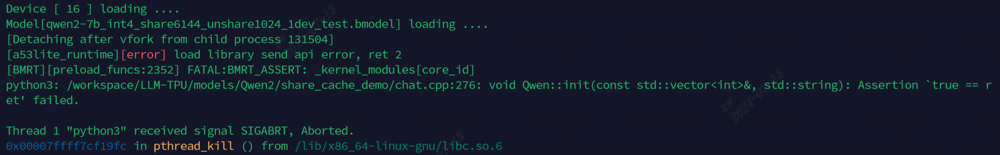
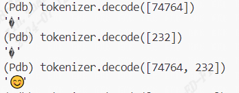
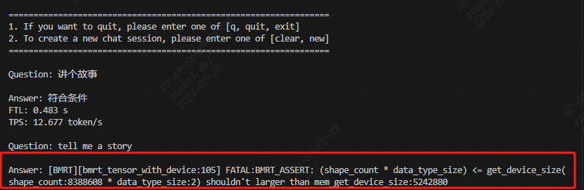
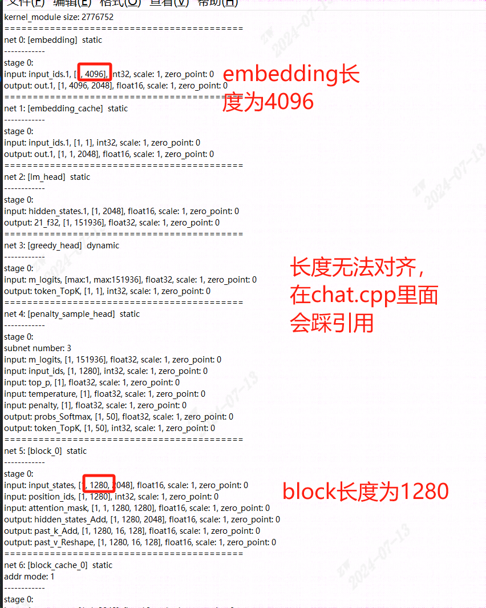
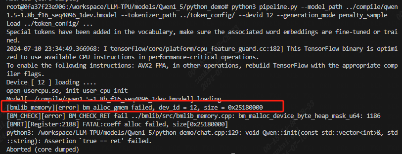
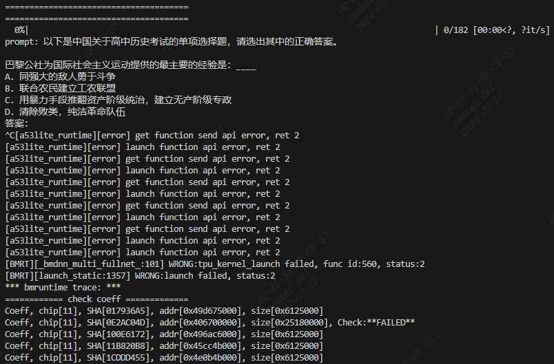
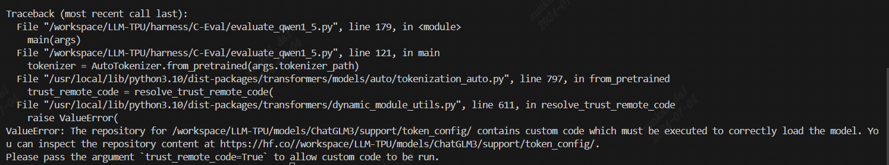
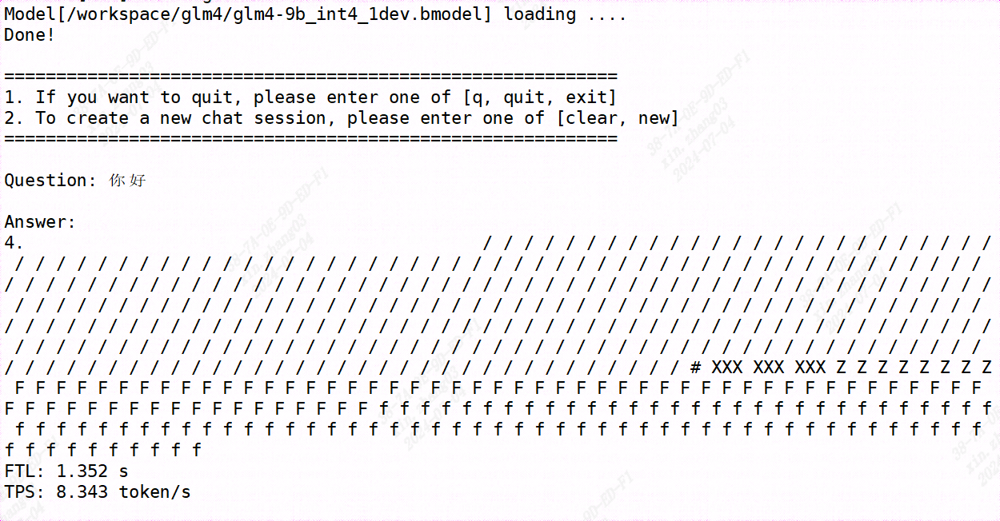
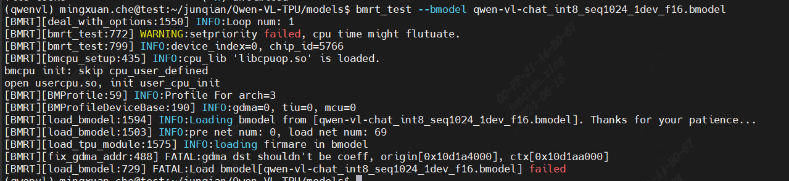
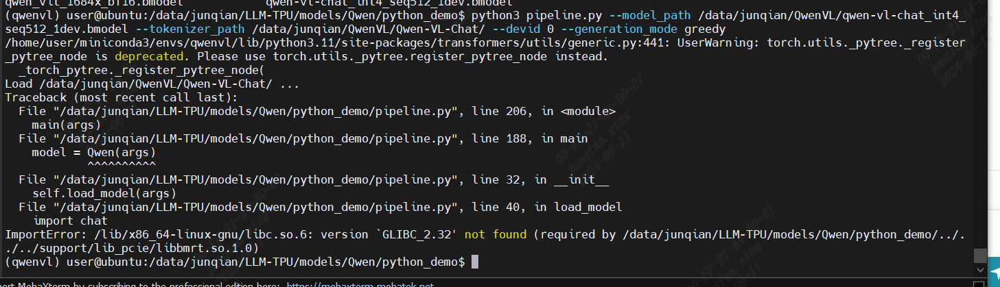

# 常见问题
  - [介绍](#介绍)
  - [快速开始](#快速开始)
  - [常见问题](#常见问题)
  - [资料链接](#资料链接)


### Q1：如果我的BM1684X环境没有联网，那么怎么跑通大语言模型？


* 首先，先在联网的大机器上git clone本项目，之后运行 `./run.sh --model llama2-7b`
* 然后，把LLM-TPU的全部文件拷贝到Airbox上，必须要是全部文件，包括LLM-TPU/models和LLM-TPU/deploy
* 最后，再在Airbox上运行 `./run.sh --model llama2-7b`


### Q2：为什么在PCIE模式下，我在docker里运行以后第一次输出会出现如下的warning？
Warning 部分：
```shell
[a53lite_runtime][error] open file /opt/sophon/libsophon-current/lib/tpu_module/libbm1684x_kernel_module.so error!!

[a53lite_runtime][error] /workspace/libsophon/bmlib/src/a53lite_api.cpp 488: load file failed!
bm_module is null!
```

这是由于docker内部本身不具有libsophon导致的，解决方法为
```shell
pip3 install dfss
python3 -m dfss --url=open@sophgo.com:/ext_model_information/LLM/libsophon_club/20240717/sophon-driver_0.5.1_amd64.deb
python3 -m dfss --url=open@sophgo.com:/ext_model_information/LLM/libsophon_club/20240717/sophon-libsophon-dev_0.5.1_amd64.deb
python3 -m dfss --url=open@sophgo.com:/ext_model_information/LLM/libsophon_club/20240717/sophon-libsophon_0.5.1_amd64.deb

sudo dpkg -i sophon-*.deb
source /etc/profile
```
完成上述步骤后，下次推理时此类warning将不会出现。


### Q3：推理出来精度异常，输出全是“！”

解决方式一：

可能是由于板子的tpu电压太低了，tpu降频就好了，降频命令如下
```shell
echo "setr tpll_clock 750000000" > /sys/kernel/debug/top/clock
echo "setr mpll_clock 1800000000" > /sys/kernel/debug/top/clock
echo "setr vpll_clock 100000000"> /sys/kernel/debug/top/clock
```

解决方式二：

断电几分钟，echo 3 > /proc/sys/vm/drop_caches  ，清缓存就正常了，有可能是什么操作造成了内存踩踏

解决方式三：

* fp16或者bf16存在溢出的问题，换成另外一种格式即可。
* 如果compile.sh中是`quantize_args="--quantize W4BF16 --q_group_size 64"`，那么换成`quantize_args="--quantize W4F16 --q_group_size 64"`
* 反之如果是`quantize_args="--quantize W4F16 --q_group_size 64"`，那么换成`quantize_args="--quantize W4BF16 --q_group_size 64"`
* compile.sh中全部`W4F16/W4BF16`都要换成`W4BF16/W4F16`

### Q4：执行python_demo时报这个错 `ValueError: vector::_M_default_append`

CMakeLists.txt版本的问题，修改CMakeLists.txt，将第一行改为cmake_minimum_required(VERSION 3.10)


### Q5：跑Qwen1_5的时候遇到，`RuntimeError: The size of tensor a (16) must match the size of tensor b (512)at non-singleton dimension 1 `

可能是torch版本不对，torch版本最好是2.0.1，不然会走spda的attention，解决方法是

```shell
pip3 install torch==2.0.1+cpu torchvision==0.15.2 -f https://download.pytorch.org/whl/cpu/torch_stable.html
```


### Q6：跑Qwen1_5、Qwen2的时候遇到，`ValueError: Tokenizer class Qwen2Tokenizer does not exist or is not currently imported.`

transformers版本不对，需要重新安装。

```shell
pip3 install transformers==4.37.0
```


### Q7：`FATAL:BMRT_ASSERT: _kernel_modules[core_id]`，详细报错如下

```shell
[Detaching after vfork from child process 131504]
[a53lite_runtime][error] load library send api error, ret 2
[BMRT][preload_funcs:2352] FATAL:BMRT_ASSERT: _kernel_modules[core_id]
python3: /workspace/LLM-TPU/models/Qwen2/share_cache_demo/chat.cpp:276: void Qwen::init(const std::vector<int>&, std::string): Assertion `true == ret' failed.

Thread 1 "python3" received signal SIGABRT, Aborted.
```


芯片挂死，换一颗芯片或者重新启动服务器（重启服务器需谨慎）

```shell
sudo reboot
```


### Q8：遇到生僻字或者emoji会出这种问号，详细报错如下

```shell
Question: my name is lao wang

Answer: Nice to meet you, ���! I'm Llama3, your helpful AI assistant. How can I assist you today? Do you have any questions, topics you'd like to discuss, or tasks you'd like to accomplish? I'm here to help!
```

在大模型里面有些不常用的字是由两个token组成，拆开解码就会出俩问号，如下图，参考[这笔提交](https://github.com/sophgo/LLM-TPU/commit/eec3c0edc33daf109d6682d5dc156ad63c83a6a1)解决




### Q9：` FATAL:BMRT ASERT: (shape count * data type size) <= get device size(shape count:8388608* data type size:2)shouldn't larger than mem get device size:`，详细报错如下



一般来说都是模型编译的有问题，长度没有对齐，可以使用以下命令来看模型shape情况

```shell
model_tool --info xxx.bmodel
```



### Q10：`[bmlib memoryllerrorl bm alloc gmem failed, dev id = 12,size = 0x25180000`，详细报错如下



一般来说都是模型过大，或者卡的空间不足，可以开一个新的终端，在跑模型的时候，使用如下命令观察
```shell
bm-smi
```

解决方式一：

如果使用bm-smi后，观察到远小于小于14000MB，可以申请更多的空间，参考[这篇文章](https://doc.sophgo.com/sdk-docs/v23.07.01/docs_latest_release/docs/SophonSDK_doc/zh/html/appendix/2_mem_edit_tools.html)
```shell
./memory_edit.sh -p
./memory_edit.sh -c -npu 7168 -vpu 3072 -vpp 4096
```

解决方式二：

可能你的模型太大了，或者使用fp16/bf16编译，你可以使用w4fp16/w4bf16编译`--mode int4`
```shell
./compile.sh --mode int4 --name qwen2-7b --addr_mode io_alone
```


### Q11：`[a53lite runtimellerror] get function send api error, ret2`，详细报错如下



可能性比较多，可能是模型有问题；可能是driver版本为0.4.8为0.4.9，太老；可能是libsophon不是最新的；可能是输入长度超过了最大长度等等

使用bm-smi来查看你的driver版本
```shell
bm-smi
```

解决方式一：

更换最新的driver
* 你可以从官网上下载，[SDK-24.04.01](https://developer.sophgo.com/site/index/material/all/all.html)
* 也可以利用dfss下载
```shell
pip3 install dfss
python3 -m dfss --url=open@sophgo.com:/ext_model_information/LLM/LLM-TPU/drivers/libsophon-0611deb.tar.gz
tar -xzf libsophon-0611deb.tar.gz
cd libsophon-0611deb
sudo apt remove sophon-driver sophon-libsophon
sudo dpkg -i *.deb
```


### Q12：`The repository for /path contains custom code which must be executed to correctly load the model`，详细报错如下



添加`trust_remote_code=True`即可解决
```python
tokenizer = AutoTokenizer.from_pretrained(args.tokenizer_path, trust_remote_code=True)
```

### Q13：输出乱码，详细报错如下



* 情况比较多，可能是模型有问题；可能是libsophon不是最新的。建议将tpu-mlir更新到最近，同时driver设置为0.5.1及以上，libsophon更新到最新，再进行尝试，参考Q11
* 可能是prompt格式的问题，可以使用transformers库的model.chat函数跑一个看看输出的tokens，system prompt是怎么样的。之后再将breakpoint()打进pipeline.py，看看tokens是否对齐

### Q14：`[BMRT][fix gdma addr:488] FATAL:gdma dst shouldn't be coeff`，详细报错如下



libsophon和driver太老，请更新，需要更新到2024年6月30号后的libsophon，参考Q11


### Q15：`ImportError: /lib/x86_64-linux-gnu/libc.so.6: version 'GLIBC 2.32' not found `，详细报错如下



编译出so的环境与使用so的环境不一致，删掉build重新编译。如果你是pcie服务器，请在docker里面编译so
```shell
rm -rf build && mkdir build
cd build && cmake .. && make
```


### Q16：！！！感叹号问题

这种问题原因是中间计算为nan，导致结果输出为！！！

并且输出nan也有讲究，是全部为nan，比如说是”！！！！！“，还是第一个正常，比如说为“我！！！！“

前者是forward_first就出错，后者是forward_next出错

第二个看是哪个block出错，定位到出错的函数，比如举例为forward_first

首先gdb到embedding前后，block前后，lmhead前后，用dump_fp16_tensor看输入输出

将输入和export_onnx的test_net_with_mask（就是自己写的torch推理）对齐，一定要保证对齐，因为之前遇到过attention_mask送到position_id去了，导致为nan

看哪个block输入是对的，输出是错（这里可能会存在block0~10都是对的，但就是block11错的）

假如这里block11是错的

之后有两种解决方式，一种是开比对：用dump_net函数把这个block11前面的输入给dump下来，然后用model_deploy开比对

一种是置零：因为传进来的输入，特别是block11->input_mem[0]，它前面一部分是真实值，后面一部分其实不是真实值，需要把后面一部分给置零，用empty函数。这种可能是后面的非真实值导致计算为nan

上面说的dump_fp16_tensor，dump_net，empty我都写在LLM-TPU/support/include/utils.h里面了，可以参考~~

还有一些情况，就是libsophon版本、驱动、tpu-mlir版本问题

### Q17 `AttributeError: 'LlamaTokenizerFast' object has no attribute 'apply_chat_template'`

这个是transformers的版本低导致的，可以更新如下：

``` shell
pip3 install git+https://github.com/huggingface/transformers
```