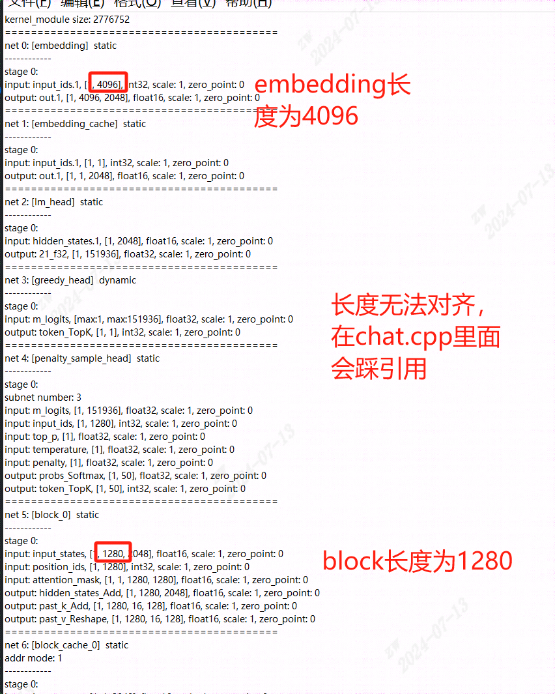
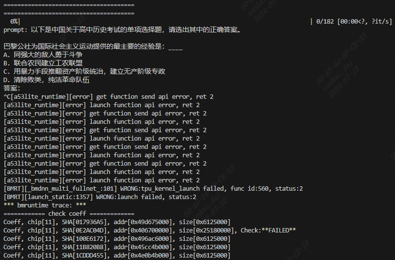
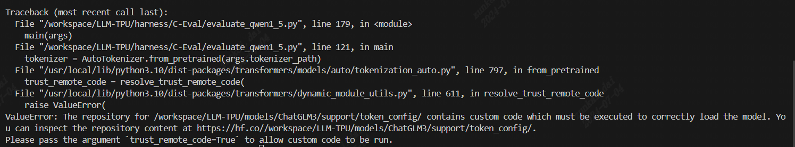
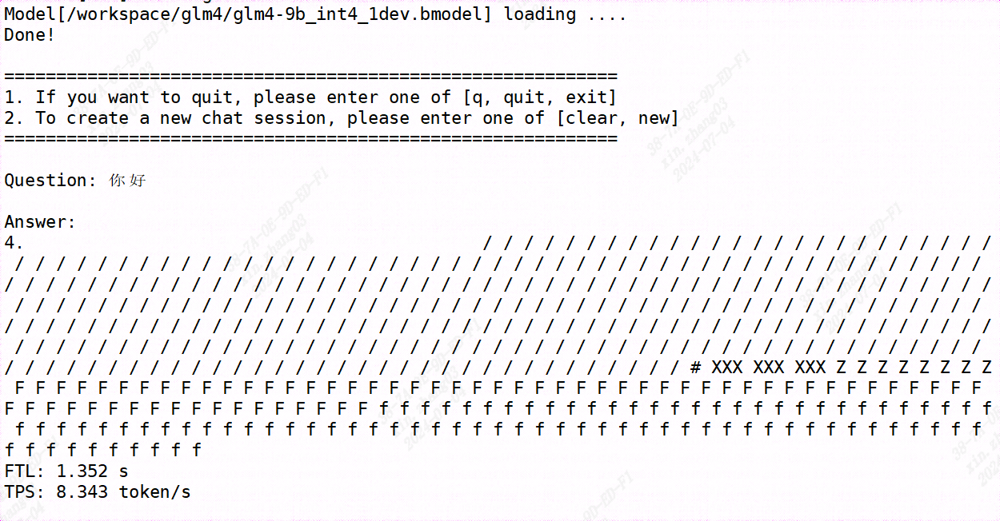
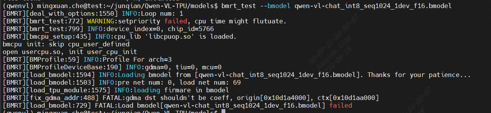
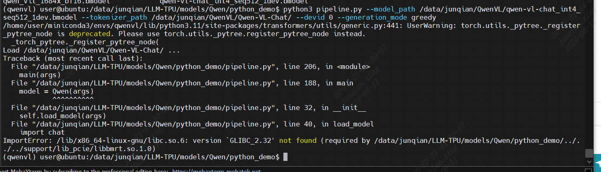

# FAQ

## Contents
- [FAQ](#faq)
  - [Q1: How can I run a large language model if my BM1684X environment is not connected to the Internet?](#q1-how-can-i-run-a-large-language-model-if-my-bm1684x-environment-is-not-connected-to-the-internet)
  - [Q2: In PCIE mode, why does the following warning appear in the first output after running in docker?](#q2-in-pcie-mode-why-does-the-following-warning-appear-in-the-first-output-after-running-in-docker)
  - [Q3: Inference accuracy is abnormal and the output is all "!"](#q3-inference-accuracy-is-abnormal-and-the-output-is-all-)
  - [Q4: Running python_demo reports this error `ValueError: vector::_M_default_append`](#q4-running-python_demo-reports-this-error-valueerror-vectorm_default_append)
  - [Q5: Encountering `RuntimeError: The size of tensor a (16) must match the size of tensor b (512) at non-singleton dimension 1` when running Qwen1_5](#q5-encountering-runtimeerror-the-size-of-tensor-a-16-must-match-the-size-of-tensor-b-512-at-non-singleton-dimension-1-when-running-qwen1_5)
  - [Q6: Encountering `ValueError: Tokenizer class Qwen2Tokenizer does not exist or is not currently imported.` when running Qwen1_5 or Qwen2](#q6-encountering-valueerror-tokenizer-class-qwen2tokenizer-does-not-exist-or-is-not-currently-imported-when-running-qwen1_5-or-qwen2)
  - [Q7: `FATAL:BMRT_ASSERT: _kernel_modules[core_id]`](#q7fatalbmrt_assert-_kernel_modulescore_id)
  - [Q8: Question marks appear when encountering rare characters or emoji](#q8-question-marks-appear-when-encountering-rare-characters-or-emoji)
  - [Q9: `FATAL:BMRT ASERT: (shape count * data type size) <= get device size`](#q9fatalbmrt-asert-shape-count--data-type-size--get-device-size)
  - [Q10: `[bmlib memoryllerrorl bm alloc gmem failed`](#q10bmlib-memoryllerrorl-bm-alloc-gmem-failed)
  - [Q11: `[a53lite runtimellerror] get function send api error, ret2`](#q11a53lite-runtimellerror-get-function-send-api-error-ret2)
  - [Q12: `The repository for /path contains custom code which must be executed to correctly load the model`](#q12the-repository-for-path-contains-custom-code-which-must-be-executed-to-correctly-load-the-model)
  - [Q13: Garbled output](#q13-garbled-output)
  - [Q14: `[BMRT][fix gdma addr:488] FATAL:gdma dst shouldn't be coeff`](#q14bmrtfix-gdma-addr488-fatalgdma-dst-shouldnt-be-coeff)
  - [Q15: `ImportError: /lib/x86_64-linux-gnu/libc.so.6: version 'GLIBC 2.32' not found`](#q15importerror-libx86_64-linux-gnulibcso6-version-glibc-232-not-found)
  - [Q16: The !!! exclamation mark issue](#q16-the--exclamation-mark-issue)
  - [Q17: `AttributeError: 'LlamaTokenizerFast' object has no attribute 'apply_chat_template'`](#q17attributeerror-llamatokenizerfast-object-has-no-attribute-apply_chat_template)
  - [Q18: `torch.onnx.errors.UnsupportedOperatorError`](#q18torchonnxerrorsunsupportedoperatorerror)
  - [Q19: `NameError: name 'Extension' is not defined`](#q19nameerror-name-extension-is-not-defined)
  - [Q20: `unzip: short read`](#q20unzip-short-read)

---

## FAQ

### Q1: How can I run a large language model if my BM1684X environment is not connected to the Internet?

**Problem Description**  
When the BM1684X environment has no Internet access, how do I run a large language model?

**Solution**  
1. On an Internet-connected host machine, run the following commands:
   ```bash
   git clone https://github.com/sophgo/LLM-TPU.git
   ./run.sh --model llama2-7b
   ```
2. Copy all files of `LLM-TPU` to the Airbox, including `LLM-TPU/models` and `LLM-TPU/deploy`.
3. On the Airbox, run the following command:
   ```bash
   ./run.sh --model llama2-7b
   ```

---

### Q2: In PCIE mode, why does the following warning appear in the first output after running in docker?

**Problem Description**  
The following warning appears at runtime:
```shell
[a53lite_runtime][error] open file /opt/sophon/libsophon-current/lib/tpu_module/libbm1684x_kernel_module.so error!!
[a53lite_runtime][error] /workspace/libsophon/bmlib/src/a53lite_api.cpp 488: load file failed!
bm_module is null!
```

**Solution**  

This is caused by an SDK version that is too old. Please download the latest SDK from the official website:
https://developer.sophgo.com/site/index/material/all/all.html

### Q3: Inference accuracy is abnormal and the output is all "!"

**Problem Description**  
The inference results are abnormal and the output is all exclamation marks "!".

**Solution**  
Possible causes and corresponding solutions are as follows:

**Method 1:** The TPU voltage is too low, causing frequency reduction. Run the following commands to lower the frequency:
```bash
echo "setr tpll_clock 750000000" > /sys/kernel/debug/top/clock
echo "setr mpll_clock 1800000000" > /sys/kernel/debug/top/clock
echo "setr vpll_clock 100000000"> /sys/kernel/debug/top/clock
```

**Method 2:** Power off for a few minutes, then clear the cache:
```bash
echo 3 > /proc/sys/vm/drop_caches
```

**Method 3:** Data format issue; switch between the `fp16` and `bf16` formats:
1. If `quantize_args` in `compile.sh` is:
   ```bash
   quantize_args="--quantize W4BF16 --q_group_size 64"
   ```
   change it to:
   ```bash
   quantize_args="--quantize W4F16 --q_group_size 64"
   ```
2. If it was originally `W4F16`, change it to `W4BF16`.

---

### Q4: Running python_demo reports this error `ValueError: vector::_M_default_append`

**Problem Description**  
The following error occurs when running `python_demo`:
```shell
ValueError: vector::_M_default_append
```

**Solution**  
Modify the `CMakeLists.txt` file and change the first line to:
```cmake
cmake_minimum_required(VERSION 3.10)
```

---

### Q5: Encountering `RuntimeError: The size of tensor a (16) must match the size of tensor b (512) at non-singleton dimension 1` when running Qwen1_5

**Problem Description**  
The following error occurs when running Qwen1_5:
```shell
RuntimeError: The size of tensor a (16) must match the size of tensor b (512) at non-singleton dimension 1
```

**Solution**  
This is caused by an incorrect `torch` version. The following version is recommended:
```bash
pip3 install torch==2.0.1+cpu torchvision==0.15.2 -f https://download.pytorch.org/whl/cpu/torch_stable.html
```

---

### Q6: Encountering `ValueError: Tokenizer class Qwen2Tokenizer does not exist or is not currently imported.` when running Qwen1_5 or Qwen2

**Problem Description**  
The following error is reported when running Qwen1_5 or Qwen2:
```shell
ValueError: Tokenizer class Qwen2Tokenizer does not exist or is not currently imported.
```

**Solution**  
Install the correct `transformers` version:
```bash
pip3 install transformers==4.37.0
```

---

### Q7: `FATAL:BMRT_ASSERT: _kernel_modules[core_id]`

**Problem Description**  
The following error occurs at runtime:
```shell
[BMRT][preload_funcs:2352] FATAL:BMRT_ASSERT: _kernel_modules[core_id]
```

**Solution**  
The chip has hung. Try the following methods:
1. Replace the chip with another one.
2. Or restart the server (proceed with caution):
   ```bash
   sudo reboot
   ```

### Q8: Question marks appear when encountering rare characters or emoji

**Problem Description**  
In large models, some uncommon characters are composed of two tokens, and question marks appear when they are decoded separately. For example:
```shell
Question: my name is lao wang

Answer: Nice to meet you, ���! I'm Llama3, your helpful AI assistant. How can I assist you today? Do you have any questions, topics you'd like to discuss, or tasks you'd like to accomplish? I'm here to help!
```
The problem may occur during the decoding process.

**Solution**  
Refer to the following [commit](https://github.com/sophgo/LLM-TPU/commit/eec3c0edc33daf109d6682d5dc156ad63c83a6a1) for the fix.

---

### Q9: `FATAL:BMRT ASERT: (shape count * data type size) <= get device size`

**Problem Description**  
The following error occurs at runtime:
```shell
FATAL:BMRT ASERT: (shape count * data type size) <= get device size(shape count:8388608 * data type size:2) shouldn't larger than mem get device size:
```
This is caused by a model compilation problem; the length is not aligned.

**Solution**  
1. Use the following command to check the model shapes:
   ```shell
   model_tool --info xxx.bmodel
   ```
   Example output:
   

2. Check and adjust the model compilation parameters based on the output information.

---

### Q10: `[bmlib memoryllerrorl bm alloc gmem failed`

**Problem Description**  
The following error occurs at runtime:
```shell
[bmlib memoryllerrorl bm alloc gmem failed, dev id = 12, size = 0x25180000
```
This is usually because the model is too large or the card does not have enough memory.

**Solution**  
**Method 1:**  
1. Open a new terminal and use the following command to observe the memory usage while the model is running:
   ```shell
   bm-smi
   ```
2. If the memory usage is far below 14000MB, you can allocate more space:
   ```shell
   ./memory_edit.sh -p
   ./memory_edit.sh -c -npu 7168 -vpu 3072 -vpp 4096
   ```
   Refer to [this article](https://doc.sophgo.com/sdk-docs/v23.07.01/docs_latest_release/docs/SophonSDK_doc/zh/html/appendix/2_mem_edit_tools.html).

**Method 2:**  
If the model is too large, try compiling with `fp16/bf16`, or compile with `w4fp16/w4bf16`:
```shell
./compile.sh --mode int4 --name qwen2-7b --addr_mode io_alone
```

---

### Q11: `[a53lite runtimellerror] get function send api error, ret2`

**Problem Description**  
The following error occurs at runtime:
  
Possible causes include:
- The model has a problem.
- The driver version is too old (e.g., 0.4.8 or 0.4.9).
- `libsophon` is not the latest version.
- The input length exceeds the maximum limit.

**Solution**  
**Method 1:**  
1. Use the following command to check the driver version:
   ```shell
   bm-smi
   ```
2. If the driver version is too old, update to the latest version:
   - Download from the official website: [SDK-24.04.01](https://developer.sophgo.com/site/index/material/all/all.html).
   - Or download using `dfss`:
     ```shell
     pip3 install dfss
     python3 -m dfss --url=open@sophgo.com:/ext_model_information/LLM/LLM-TPU/drivers/libsophon-0611deb.tar.gz
     tar -xzf libsophon-0611deb.tar.gz
     cd libsophon-0611deb
     sudo apt remove sophon-driver sophon-libsophon
     sudo dpkg -i *.deb
     ```

---

### Q12: `The repository for /path contains custom code which must be executed to correctly load the model`

**Problem Description**  
The following error occurs at runtime:
  
This is because loading the model requires trusting remote code.

**Solution**  
Add the `trust_remote_code=True` parameter in the code:
```python
tokenizer = AutoTokenizer.from_pretrained(args.tokenizer_path, trust_remote_code=True)
```

---

### Q13: Garbled output

**Problem Description**  
The runtime output is garbled, as shown below:
  
Possible causes include:
- The model has a problem.
- `libsophon` is not the latest version.
- The `prompt` format has a problem.

**Solution**  
1. Update `tpu-mlir` to the latest version, set the driver to 0.5.1 or above, and update `libsophon`; refer to Q11.
2. Check the `prompt` format:
   - Use the `model.chat` function of the `transformers` library to test the output tokens and `system prompt`.
   - Set a breakpoint in `pipeline.py` to check whether the tokens are aligned.

---

### Q14: `[BMRT][fix gdma addr:488] FATAL:gdma dst shouldn't be coeff`

**Problem Description**  
The following error occurs at runtime:
  
This is because the `libsophon` and driver versions are too old.

**Solution**  
Update `libsophon` and the driver to a version released after June 30, 2024; refer to Q11.

---

### Q15: `ImportError: /lib/x86_64-linux-gnu/libc.so.6: version 'GLIBC 2.32' not found`

**Problem Description**  
The following error occurs at runtime:
  
This is because the compilation environment is inconsistent with the runtime environment.

**Solution**  
1. Delete the `build` folder and recompile:
   ```shell
   rm -rf build && mkdir build
   cd build && cmake .. && make
   ```
2. If it is a PCIE server, compile the so file in the docker environment.

---

### Q16: The !!! exclamation mark issue

**Problem Description**  
A large number of exclamation marks ("!!!") appear in the inference results, which may be caused by `nan` in intermediate computations.  
- If the results are all `nan` (e.g., "!!!"), then `forward_first` has an error.
- If only part of the results are `nan` (e.g., "I!!!!"), then `forward_next` has an error.

**Solution**  
1. Use `gdb` to locate the problem:
   - Use `dump_fp16_tensor` to check the inputs and outputs before and after `embedding`, before and after each `block`, and before and after `lmhead`.
   - Make sure the inputs are aligned with `test_net_with_mask` in `export_onnx`.
2. If a certain block has an error (e.g., block11), try the following methods:
   - **Enable comparison:** Use the `dump_net` function to export the inputs of block11 and compare them with `model_deploy`.
   - **Zeroing:** Set non-real values to zero using the `empty` function.
3. Check whether the `libsophon` version, driver version, and `tpu-mlir` version match.

---

### Q17: `AttributeError: 'LlamaTokenizerFast' object has no attribute 'apply_chat_template'`

**Problem Description**  
The following error occurs at runtime:
```shell
AttributeError: 'LlamaTokenizerFast' object has no attribute 'apply_chat_template'
```
This is because the `transformers` version is too old.

**Solution**  
Update `transformers`:
```shell
pip3 install git+https://github.com/huggingface/transformers
```

---

### Q18: `torch.onnx.errors.UnsupportedOperatorError`

**Problem Description**  
The following error occurs at runtime:
```shell
torch.onnx.errors.UnsupportedOperatorError: Exporting the operator 'aten::_convolution_mode' to ONNX opset version 15 is not supported.
```
This usually occurs with the `Conv` operator in multimodal models and is caused by a `torch` version that is too old.

**Solution**  
Update the `torch` version:
```shell
pip install torch==2.5.1 --index-url https://download.pytorch.org/whl/cpu
```

---

### Q19: `NameError: name 'Extension' is not defined`

**Problem Description**  
The following error occurs at runtime:
```bash
NameError: name 'Extension' is not defined
```
This is because the `Jinja2` dependency is missing.

**Solution**  
Install `Jinja2`:
```shell
pip3 install Jinja2
```

---

### Q20: `unzip: short read`

**Problem Description**  
The following error occurs at runtime:
```shell
unzip: short read
```

**Solution**  
Install the `zip` tool:
```shell
sudo apt install zip
```
