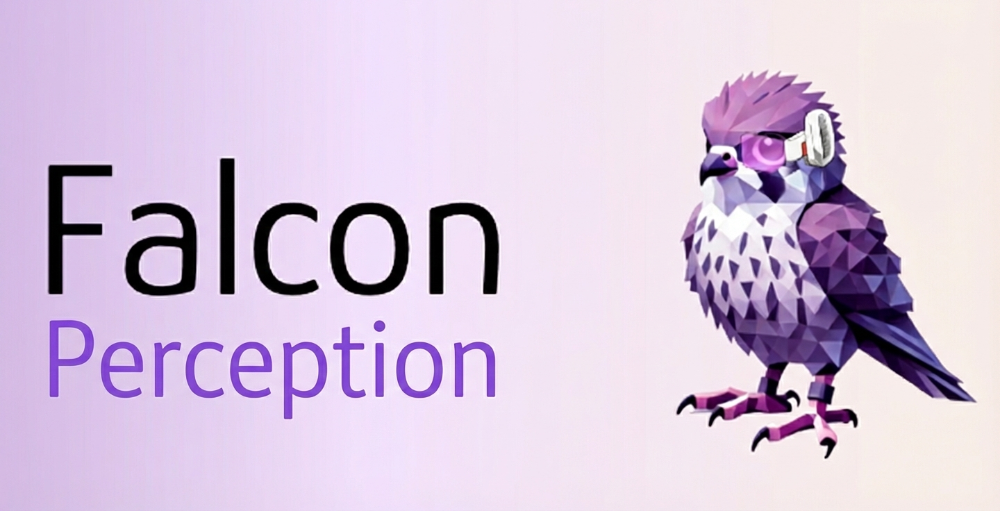

## Falcon Perception

Falcon Perception is a 0.6B parameter early-fusion vision-language model for open-vocabulary grounding and instance segmentation. Given an image and a natural language query, it returns zero, one, or many matching instances with pixel-accurate masks.

The model is built around a simple interface. Image patches and text tokens are processed together in a single Transformer using a hybrid attention mask: image tokens build bidirectional visual context, while text and task tokens decode causally conditioned on the image. For each instance, the model generates a short structured sequence of task tokens in a fixed order, `<|coord|>` then `<|size|>` then `<|seg|>`. The `<|seg|>` token acts as a mask query whose hidden state is projected and dotted with upsampled image features, producing a full-resolution binary mask without autoregressive mask generation.


### Links

- Code and inference engine: `https://github.com/tiiuae/Falcon-Perception`
- Tech report: arXiv link coming soon
- PBench dataset: `tiiuae/PBench`
- OCR model: `tiiuae/Falcon-OCR`

## Quickstart

### Installation

```bash
pip install "torch>=2.5" transformers pillow einops pycocotools
```

This model requires PyTorch 2.5 or newer for FlexAttention. The first call can be slower because `torch.compile` may build optimized kernels.

### Run open-vocabulary segmentation

```python
import torch
from PIL import Image
from transformers import AutoModelForCausalLM

model = AutoModelForCausalLM.from_pretrained(
    "tiiuae/falcon-perception",
    trust_remote_code=True,
    device_map={"": "cuda:0"},
)

image = Image.open("photo.jpg")
preds = model.generate(image, "cat")[0]

for p in preds:
    print(p["xy"], p["hw"])
```

### Decode masks

```python
import numpy as np
from pycocotools import mask as mask_utils

for p in preds:
    rle = p["mask_rle"]
    # pycocotools expects bytes for counts
    m = {"size": rle["size"], "counts": rle["counts"].encode("utf-8")}
    mask = mask_utils.decode(m).astype(bool)  # H x W
    print(mask.shape, mask.sum())
```

## API

### `model.generate(images, queries, **kwargs)`

| Parameter | Type | Default | Description |
|---|---|---|---|
| `images` | `PIL.Image` or `list` | required | Single image or list of images |
| `queries` | `str` or `list[str]` | required | Query string(s), one per image |
| `max_new_tokens` | `int` | `2048` | Maximum decoding steps |
| `min_dimension` | `int` | `256` | Minimum image side after resize |
| `max_dimension` | `int` | `1024` | Maximum image side after resize |
| `compile` | `bool` | `True` | Run `torch.compile` on first call |

**Returns:** `list[list[dict]]`, one list per image.

Each prediction dict contains:

```python
{
  "xy": {"x": float, "y": float},                    # center in normalized coordinates (0 to 1)
  "hw": {"h": float, "w": float},                    # size in normalized coordinates (0 to 1)
  "mask_rle": {"counts": str, "size": [H, W]},       # COCO RLE at original resolution
}
```

## What the model is for

Falcon Perception is designed for dense grounding regimes where the main difficulty is localization under open vocabulary. That includes:

- Natural language driven object selection in images
- Promptable instance segmentation for downstream pipelines
- Crowded scenes where the number of instances is large and variable

It is not intended as a general-purpose vision-language assistant for open-ended reasoning, long-form generation, or multi-step VQA.

## Model details (high level)

The architecture follows a single-stack early-fusion recipe:

- One dense Transformer backbone processes image patches and text tokens in a shared space from the first layer
- Hybrid attention masking: bidirectional among image tokens, causal for text and task tokens conditioned on the image
- Chain-of-Perception decoding: `<|coord|>` then `<|size|>` then `<|seg|>` per instance
- Specialized heads for coordinates and size, with geometry conditioning via Fourier features
- Parallel mask decoding: each `<|seg|>` token becomes a mask query and produces a full-resolution mask via dot product with upsampled image features

## Evaluation summary

From the technical report:

- SA-Co (open-vocabulary segmentation): 68.0 Macro F1 compared to 62.3 for SAM 3, with the main remaining gap being presence calibration (Average MCC 0.64 compared to 0.82 for SAM 3)
- PBench: a diagnostic benchmark that breaks down performance by capability (attributes, OCR-guided disambiguation, spatial constraints, relations) and includes a dense long-context crowded split

Full tables, setup details, and ablations are in the report.

## Limitations

- Presence calibration remains a key limitation for autoregressive dense interfaces. False positives are more likely on hard negatives than in DETR like segmentation models.
- OCR-driven prompts depend on text size and image resolution. Small text and degraded scans are challenging.
- Dense scenes benefit strongly from high resolution inputs. Low resolution can be sufficient to recognize that a concept is present, but insufficient to localize each instance precisely.

## Citation

If you use Falcon Perception, please cite:

```bibtex
@article{bevli2026falcon,
  title   = {Falcon Perception},
  author  = {Bevli, Aviraj and Chaybouti, Sofian and Dahou, Yasser and Hacid, Hakim and Huynh, Ngoc Dung and Le Khac, Phuc H. and Narayan, Sanath and Para, Wamiq Reyaz and Singh, Ankit},
  journal = {arXiv preprint arXiv:2603.27365},
  year    = {2026},
  url     = {https://arxiv.org/abs/2603.27365}
}
```