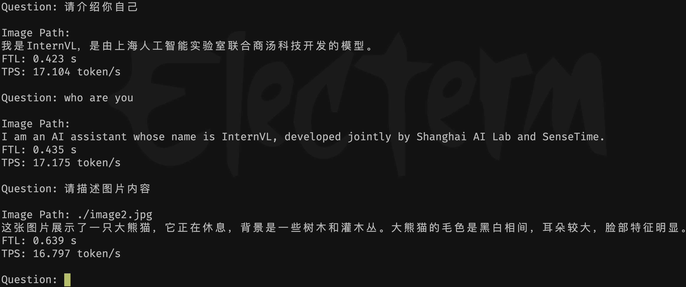

# InternVL2

This project implements the deployment of the multimodal large model [InternVL2-4B](https://huggingface.co/OpenGVLab/InternVL2-4B) on BM1684X. The model is converted into a bmodel using the [TPU-MLIR](https://github.com/sophgo/tpu-mlir) compiler, and deployed with C++ code to the BM1684X PCIE environment or SoC environment.

## Development Environment Setup

#### 1. Download `InternVL2-4B` from HuggingFace

(It is quite large and will take a long time.)

``` shell
git lfs install
git clone git@hf.co:OpenGVLab/InternVL2-4B
```

In addition, some modifications to the model source code are required:
Replace the corresponding files in `InternVL2-4B` with the files under `compile/files/InternVL2-4B/`.

#### 2. Export to ONNX model

If you are prompted that certain components are missing during the process, simply `pip3 install component`.

``` shell
# install components
pip3 install transformers_stream_generator einops tiktoken accelerate
pip3 install git+https://github.com/huggingface/transformers

# export onnx
cd compile
python3 export_onnx.py --model_path your_internvl2_path
```

## Compile the model

This section describes how to compile the ONNX model into a bmodel. You can also skip this compilation step and directly download the precompiled model:

``` shell
python3 -m dfss --url=open@sophgo.com:/ext_model_information/LLM/LLM-TPU/internvl2-4b_bm1684x_int4.bmodel
```

#### 1. Download docker and start the container

``` shell
docker pull sophgo/tpuc_dev:latest

# myname1234 is just an example, you can set your own name
docker run --privileged --name myname1234 -v $PWD:/workspace -it sophgo/tpuc_dev:latest bash

docker exec -it myname1234 bash
```
The following assumes the environment is in the `/workspace` directory of the docker container.

#### 2. Download the `TPU-MLIR` code and compile it

(You can also directly download and extract the prebuilt release package.)

``` shell
cd /workspace
git clone git@github.com:sophgo/tpu-mlir.git
cd tpu-mlir
source ./envsetup.sh  # activate environment variables
./build.sh # compile mlir
```

#### 3. Compile the model to generate the bmodel

Compile the ONNX model to generate the model `internvl2-4b_bm1684x_int4.bmodel`.

``` shell
./compile.sh --name internvl2-4b
```

## Compile and run the program

* Environment preparation
> (This must be executed before running python_demo.)
```
sudo apt-get update
sudo apt-get install pybind11-dev
pip3 install transformers_stream_generator einops tiktoken accelerate transformers==4.37.2
```

Compile the library files to generate the `chat.cpython*.so` file, and copy this file to the directory where `pipeline.py` is located.

```
cd python_demo
mkdir build
cd build && cmake .. && make && cp *cpython* .. && cd ..
```

* python demo

```
python3 pipeline.py --model_path internvl2-4b_bm1684x_int4.bmodel --tokenizer ../support/token_config_4b --devid 0
```
model is the actual storage path of the model; tokenizer_path is the actual storage path of the tokenizer configuration.

* Running result



## FAQ

#### Is InternVL2-2B supported?

Yes, it is supported, and the steps are basically the same.
1. Replace the corresponding files in `InternVL2-2B` with the files in `files/InternVL2-2B`;
2. Run `export_onnx.py` with the `InternVL2-2B` path specified to export ONNX;
3. Run `./compile.sh --name internvl2-2b` to generate the model `internvl2-2b_bm1684x_int4.bmodel`;
4. Running the program is the same, but you need to specify `token_config_2b`; run the command: `python3 pipeline.py --model_path internvl2-4b_bm1684x_int4.bmodel --tokenizer ../support/token_config_2b --devid 0`
