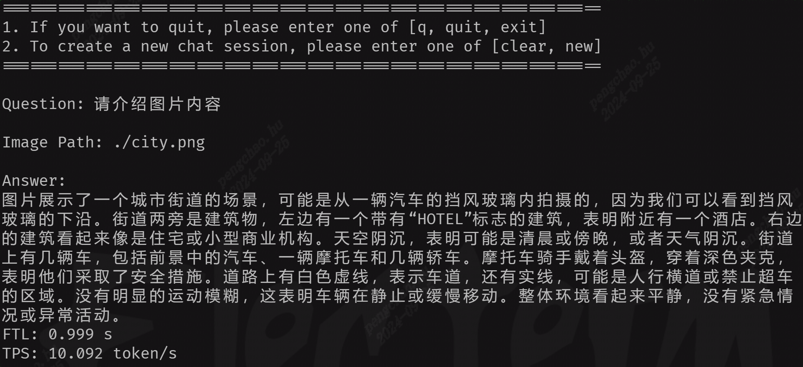

# MiniCPM-V-2_6

This project deploys the language large model [MiniCPM-V-2_6](https://huggingface.co/openbmb/MiniCPM-V-2_6) on BM1684X. The model is converted into a bmodel using the [TPU-MLIR](https://github.com/sophgo/tpu-mlir) compiler, and deployed to the BM1684X PCIE or SoC environment using C++ code.

## Development environment setup

#### 1. Download `MiniCPM-V-2_6` from HuggingFace

(The model is quite large and will take a long time)

``` shell
git lfs install
git clone git@hf.co:openbmb/MiniCPM-V-2_6
```

In addition, some modifications to the model source code are required:
* Replace the `model_qwen2.py` file in transformers with the `model_qwen2.py` under `compile/files`
* Replace the corresponding files in `MiniCPM-V-2_6` with the other files under `compile/files`.

#### 2. Export to onnx model

If you are prompted that some components are missing during the process, simply run `pip3 install <component>`

``` shell
# Export onnx
cd compile
python3 export_onnx.py --model_path your_minicpmv_path
```

## Compile the model

This section describes how to compile the onnx model into a bmodel. You can also skip the compilation step and directly download the precompiled model:

``` shell
python3 -m dfss --url=open@sophgo.com:/ext_model_information/LLM/LLM-TPU/minicpmv26_bm1684x_int4_seq1024_imsize448.bmodel
```

#### 1. Download docker and start the container

``` shell
docker pull sophgo/tpuc_dev:latest

# myname1234 is just an example, you can set your own name
docker run --privileged --name myname1234 -v $PWD:/workspace -it sophgo/tpuc_dev:latest bash

docker exec -it myname1234 bash
```
The following sections assume the environment is in the `/workspace` directory inside docker.

#### 2. Download the `TPU-MLIR` code and compile it

(You can also directly download and extract the precompiled release package)

``` shell
cd /workspace
git clone git@github.com:sophgo/tpu-mlir.git
cd tpu-mlir
source ./envsetup.sh  # activate environment variables
./build.sh # compile mlir
```

#### 3. Compile the model to generate the bmodel

Compile the ONNX model to generate the model

For details, please refer to python_demo/README.md

## Compiling and running the program

Compile the library to generate the `chat.cpython*.so` file, then copy it to the directory containing `pipeline.py`

```
cd python_demo
mkdir build
cd build && cmake .. && make && cp *cpython* .. && cd ..
```

Run the program as follows:

```
python3 pipeline.py --model_path minicpmv26_bm1684x_int4.bmodel --tokenizer_path ../support/token_config --devid 0
```
`model_path` is the actual path where the model is stored; `tokenizer_path` is the actual path where the tokenizer configuration is stored

* Demo result


