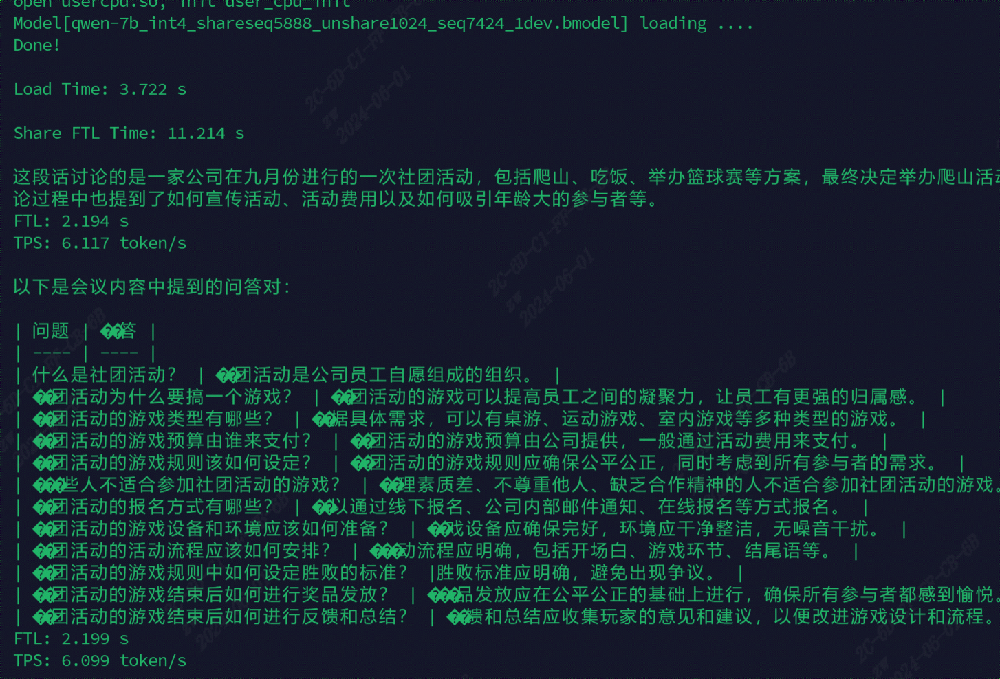

# Command
```
cp files/Qwen-7B-Chat/* your_torch_model

python export_onnx.py --model_path ../prompt_cache_demo/Qwen-7B-Chat --device cpu --share_length 5888 --unshare_length 1024 --seq_length 7424 --num_thread 16 --batch_size 1

./compile.sh --mode int4 --name qwen-7b --share_length 5888 --addr_mode io_alone --unshare_length 1024
```

# 直接下载
如果你不想编译模型，也可以直接下载
```
pip3 install dfss
python3 -m dfss --url=open@sophgo.com:/ext_model_information/LLM/LLM-TPU/qwen-7b_int4_shareseq5888_unshare1024_seq7424_1dev.bmodel
```
* 使用的TPU-MLIR版本：cb7ae49e78f2f8641a7d0f995733431ad04a79eb

# 分片方式
|第一片                  |第二片                 |第三片              |
|:-                     |:-                     |:-                 |
|share                  |unshare                |decode             |
|share_length=5888      |unshare_length=1024    |decode_length=512  |

这样分片刚好在9.8~9.9G左右

# 编译库文件
```
mkdir build
cd build && cmake .. && make && cp *cpython* .. && cd ..
```

# python demo
```
python3 pipeline.py --model_path qwen-7b_int4_shareseq5888_unshare1024_seq7424_1dev.bmodel --tokenizer_path ../support/token_config/ --devid 0 --generation_mode penalty_sample
```

# 效果图

