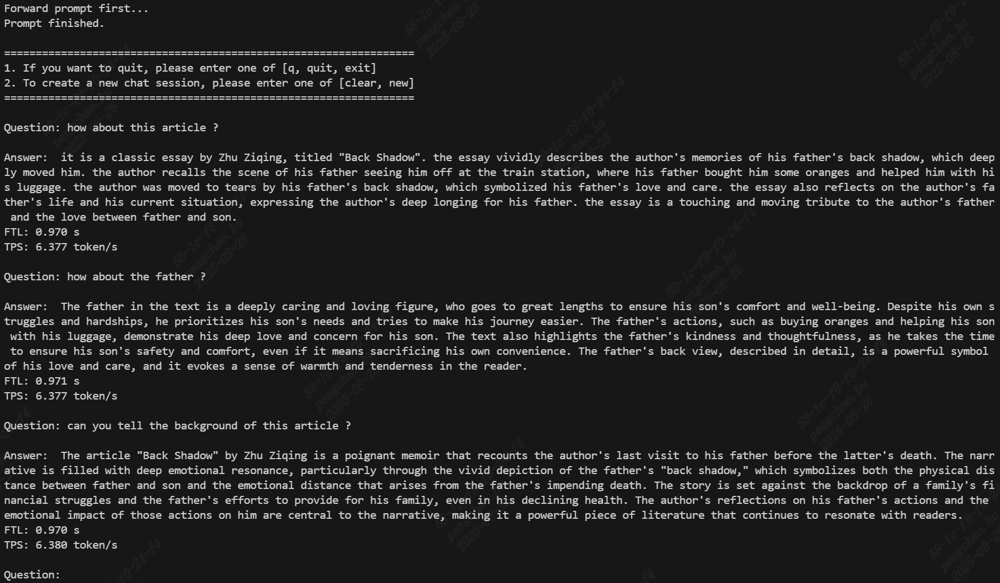

# Shared prompt

A long prompt can be converted into a KV cache, and subsequent conversation content always shares this KV cache. It divides the model into three stages: prompt inference, prefill inference, and decode inference.
If the prompt does not change, the prompt inference only needs to be performed once.
Method: add `--share_prompt` to the `llm_converter.py` command, and specify `--max_prefill_kv_length`

You can directly use the following pre-compiled model to verify:
``` shell
# 8K context, maximum prompt length is 4K, maximum input length per conversation turn is 512
python3 -m dfss --url=open@sophgo.com:/ext_model_information/LLM/LLM-TPU/qwen2.5-7b-instruct-awq_w4f16_seq8192_bm1684x_1dev_20250822_154040.bmodel
```

## Model compilation

``` shell
# -s specifies the total length; --max_input_length specifies the maximum length of each input; --max_prefill_kv_length specifies the maximum length of the shared prompt, which generates a shared KV cache passed to prefill
llm_convert.py -m /workspace/Qwen2.5-7B-Instruct-AWQ -s 8192 --quantize w4bf16 -c bm1684x --share_prompt --max_input_length 512 --max_prefill_kv_length 4096 --out_dir qwen2.5_7b_share
```


## Run
```shell
mkdir build
cd build && cmake .. && make && cp *cpython* .. && cd ..
python3 pipeline.py -m ./qwen2.5-7bxxxx.bmodel -c ../config --prompt test.txt
```

The demo effect is as follows:

