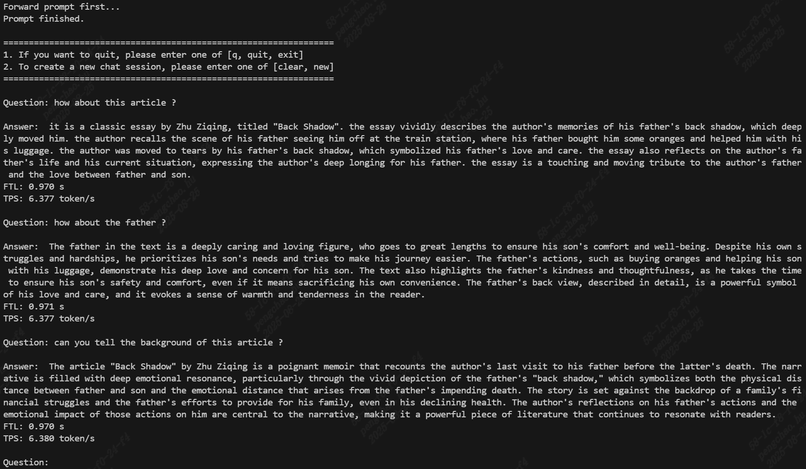

# Shared prompt

A long prompt can be converted into a KV cache, and subsequent conversation content always shares this KV cache. It divides the model into three stages: prompt inference, prefill inference, and decode inference.
If the prompt does not change, the prompt inference only needs to be performed once.
Method: add `--use_history_kv` to the `llm_convert.py` command. With `--use_history_kv`, the converter generates both the normal prefill block (`block_*`) and the history-KV prefill block (`block_kv_*`), so a shared prompt's KV cache can be reused directly — the old `--share_prompt` and `--max_prefill_kv_length` options have been removed.

You can directly use the following pre-compiled model to verify:
``` shell
# 8K context, maximum prompt length is 4K, maximum input length per conversation turn is 512
python3 -m dfss --url=open@sophgo.com:/ext_model_information/LLM/LLM-TPU/qwen2.5-7b-instruct-awq_w4f16_seq8192_bm1684x_1dev_20250822_154040.bmodel
```

## Model compilation

``` shell
# -s specifies the total length; --chunk_length specifies the maximum length of each prefill chunk (defaults to seq_length // 4); the shared prompt's KV cache can occupy up to the total seq_length
llm_convert.py -m /workspace/Qwen2.5-7B-Instruct-AWQ -s 8192 --quantize w4bf16 -c bm1684x --use_history_kv --chunk_length 512 --out_dir qwen2.5_7b_share
```


## Run
```shell
mkdir build
cd build && cmake .. && make && cp *cpython* .. && cd ..
python3 pipeline.py -m ./qwen2.5-7bxxxx.bmodel -c ../config --prompt test.txt
```

The demo effect is as follows:

