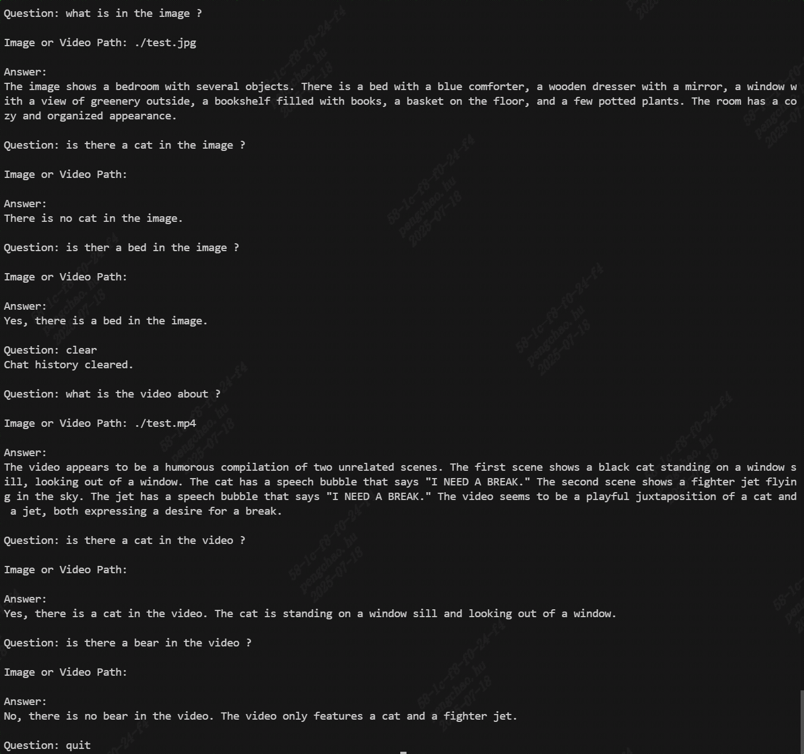

# Qwen2.5-VL

This project demonstrates deploying the multimodal large model [Qwen2.5-VL](https://huggingface.co/Qwen/Qwen2.5-VL-3B-Instruct-AWQ) on BM1684X/BM1688. The model is converted into a bmodel using the [TPU-MLIR](https://github.com/sophgo/tpu-mlir) compiler and deployed to a PCIE environment or an SoC environment using C++ code.

This model can be used for image or video recognition, and demos are provided in both python and cpp versions.

This document covers how to compile the bmodel and how to run the bmodel in BM1684X/BM1688 environments. The bmodel compilation step can be skipped by downloading directly from the following links:

``` shell
# =============== 1684x =====================
# 1684x 3B 2K, max_pixel 672x896, supports videos up to 20s (1 frame per second)
python3 -m dfss --url=open@sophgo.com:/ext_model_information/LLM/LLM-TPU/qwen2.5-vl-3b-instruct-awq_w4bf16_seq2048_bm1684x_1dev_20250428_143625.bmodel
# 1684x 7B 2K, max_pixel 672x896
python3 -m dfss --url=open@sophgo.com:/ext_model_information/LLM/LLM-TPU/qwen2.5-vl-7b-instruct-awq_w4bf16_seq2048_bm1684x_1dev_20250428_150810.bmodel
# 1684x 7B 8K, max_pixel 672x896, supports videos up to 80s (1 frame per second)
python3 -m dfss --url=open@sophgo.com:/ext_model_information/LLM/LLM-TPU/qwen2.5-vl-7b-instruct-awq_w4bf16_seq8192_bm1684x_1dev_20250430_115515.bmodel

# Advanced 1: 1684x 3B 4K, max_pixel 672x896, supports historical context, max input length is 1024
python3 -m dfss --url=open@sophgo.com:/ext_model_information/LLM/LLM-TPU/qwen2.5-vl-3b-instruct-awq_w4bf16_seq4096_bm1684x_1dev_20250717_171504.bmodel
# Advanced 2: 1684x 3B 8K, dynamic compilation, latency varies with input length
python3 -m dfss --url=open@sophgo.com:/ext_model_information/LLM/LLM-TPU/qwen2.5-vl-3b-instruct-awq_w4bf16_seq8192_bm1684x_1dev_dyn_20250722_203019.bmodel

# =============== 1684x =====================
# 1688 3B 2K, max_pixel 672x896
python3 -m dfss --url=open@sophgo.com:/ext_model_information/LLM/LLM-TPU/qwen2.5-vl-3b-instruct-awq_w4bf16_seq2048_bm1688_2core_20250428_144952.bmodel
# 1688 7B 2K, max_pixel 672x896
python3 -m dfss --url=open@sophgo.com:/ext_model_information/LLM/LLM-TPU/qwen2.5-vl-7b-instruct-awq_w4bf16_seq2048_bm1688_2core_20250428_152052.bmodel
```

## Compile the LLM model

This section describes how to compile the LLM into a bmodel.

#### 1. Download `Qwen2.5-VL-3B-Instruct-AWQ` from HuggingFace

(The file is large and will take a long time.)

``` shell
# Download the model
git lfs install
git clone git@hf.co:Qwen/Qwen2.5-VL-3B-Instruct-AWQ
# For the 7B model:
git clone git@hf.co:Qwen/Qwen2.5-VL-7B-Instruct-AWQ
```

#### 2. Download docker and start the container

``` shell
docker pull sophgo/tpuc_dev:latest

# myname1234 is just an example, you can set your own name
docker run --privileged --name myname1234 -v $PWD:/workspace -it sophgo/tpuc_dev:latest
```
The following assumes that the environment is in the docker `/workspace` directory.

#### 2. Download the `TPU-MLIR` code and compile it

(You can also directly download and extract a prebuilt release package.)

``` shell
cd /workspace
git clone git@github.com:sophgo/tpu-mlir.git
cd tpu-mlir
source ./envsetup.sh  # activate environment variables
./build.sh # compile mlir
```

#### 3. Compile the model to generate the bmodel

``` shell
# If you get transformers version issues, run pip3 install transformers -U
llm_convert.py -m /workspace/Qwen2.5-VL-3B-Instruct-AWQ -s 2048 --quantize w4f16  -c bm1684x --out_dir qwen2.5vl_3b --max_pixels 672,896
```

## Compile and run the program (python)

* Environment preparation
> (This must be done before running python_demo.)
``` shell
# If it is not python3.10, refer to "FAQ" to configure the environment
pip3 install torchvision pillow qwen_vl_utils transformers>=4.49.0
```

Compile the library files to generate the `chat.cpython*.so` file, then copy it to the `pipeline.py` directory.

``` shell
cd python_demo
mkdir build 
cd build && cmake .. && make && cp *cpython* .. && cd ..

# run demo
python3 pipeline.py -m xxxx.bmodel -c config 
```
model is the actual model storage path; config_path is the configuration file path.

## Compile and run the program (cpp)

``` shell
cd cpp_demo
mkdir build 
cd build && cmake .. && make && cp pipeline .. && cd ..

# run demo
./pipeline -m xxx.bmodel -c config
```

## Advanced usage

### 1. Support for historical context

By default, the model does not support historical context; the `--use_history_kv` parameter is required;
you need to specify the prefill chunk length `--chunk_length`; if not specified, it defaults to 1/4 of seq_length;
the history KV length is fixed at seq_length.

As follows:
``` shell
# If you get transformers version issues, run pip3 install transformers -U
llm_convert.py -m /workspace/Qwen2.5-VL-3B-Instruct-AWQ -s 4096 --quantize w4f16  -c bm1684x --out_dir qwen2.5vl_3b --max_pixels 672,896 --use_history_kv --chunk_length 1024
```
Both cpp_demo and python_demo support it. Type clear to clear the history. The result is as follows:



### 2. Support for dynamic compilation

By default, the model is statically compiled: inference runs at the specified `seq_length`, with shorter inputs padded with zeros and masked out. Dynamic compilation performs inference dynamically according to the input length, which can reduce latency for short inputs when input lengths vary greatly. Just add `--dynamic` to the command.
When images in real applications vary in size, the ViT can be made dynamic to ensure ViT performance in all cases.

```shell
llm_convert.py -m /workspace/Qwen2.5-VL-3B-Instruct-AWQ -s 8192 --quantize w4f16  -c bm1684x --out_dir qwen2.5vl_3b_dyn  --max_pixels 672,896 --dynamic
```
Both `cpp_demo` and `python_demo` support it.

### 3. Support for multi-task

The same model can be loaded multiple times to support multi-task; if it is on the same chip, the weights are loaded only once. However, running multi-task on a single chip is not recommended.
Refer to `cpp_demo_multiuser`.

### 4. Support for multiple images

Multiple images are supported, whether as separate images or by treating multiple images as a video. Refer to `python_demo_multiimage`.


## FAQ

#### How to configure a python3.10 environment on SoC?

The installation process is as follows:

``` shell
sudo add-apt-repository ppa:deadsnakes/ppa
sudo apt update
sudo apt install python3.10 python3.10-dev
```

Python virtual environment configuration:

``` shell
cd /data
# Create a virtual environment (without pip)
python3.10 -m venv --without-pip myenv

# Enter the virtual environment
source myenv/bin/activate

# Install pip manually
curl https://bootstrap.pypa.io/get-pip.py -o get-pip.py
python get-pip.py
rm get-pip.py

# Install dependency libraries
pip3 install torchvision pillow qwen_vl_utils transformers --upgrade

```

#### How many tokens does one image occupy?

Formula: $ tokens = height × width ÷ 28 ÷ 28 $
For example, a 672x896 image occupies 768 tokens.

#### How many tokens does a video occupy?

In this example, the video size defaults to 1/4 of the image size. For example, in the 672x896 case, the size 336x448 is used, which means every two frames (`temporal_patch_size`) occupy 192 tokens.

The default is 1 frame per second.

A 20-second video takes 20 frames, for a total of $ 192 × 20 ÷ 2 = 1920 $ tokens.
