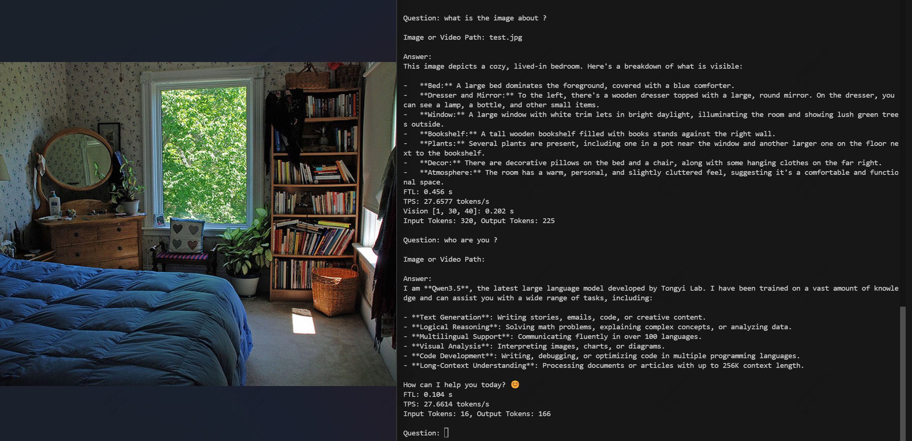

# Qwen3_5

This project demonstrates deploying the multimodal large model [Qwen3.5](https://www.modelscope.cn/collections/Qwen/Qwen35) on BM1684X/BM1688. The model is converted into a bmodel using the [TPU-MLIR](https://github.com/sophgo/tpu-mlir) compiler and deployed to a PCIE environment or an SoC environment.

This model can be used for image or video recognition, and demos are provided in both python and cpp versions.

This document covers how to compile the bmodel and how to run the bmodel in BM1684X/BM1688 environments. The bmodel compilation step can be skipped by downloading directly from the following links:

``` shell
# =============== 1684x =====================
python3 -m dfss --url=open@sophgo.com:/ext_model_information/LLM/LLM-TPU/qwen3.5-2b-int4-autoround_w4bf16_seq2048_bm1684x_1dev_dynamic_20260415_111517.bmodel
python3 -m dfss --url=open@sophgo.com:/ext_model_information/LLM/LLM-TPU/qwen3.5-4b-int4-autoround_w4bf16_seq2048_bm1684x_1dev_dynamic_20260416_144422.bmodel
python3 -m dfss --url=open@sophgo.com:/ext_model_information/LLM/LLM-TPU/qwen3.5-9b-int4-autoround_w4bf16_seq2048_bm1684x_1dev_dynamic_20260416_150658.bmodel

# Supports 8K and historical context
python3 -m dfss --url=open@sophgo.com:/ext_model_information/LLM/LLM-TPU/qwen3.5-4b-int4-autoround_w4bf16_seq8192_bm1684x_1dev_dynamic_20260622_175403.bmodel

# =============== 1688 ======================
python3 -m dfss --url=open@sophgo.com:/ext_model_information/LLM/LLM-TPU/qwen3.5-2b-int4-autoround_w4bf16_seq2048_bm1688_2core_dynamic_20260415_212627.bmodel
python3 -m dfss --url=open@sophgo.com:/ext_model_information/LLM/LLM-TPU/qwen3.5-4b-int4-autoround_w4bf16_seq2048_bm1688_2core_dynamic_20260416_145112.bmodel

```


## Compile the LLM model

This section describes how to compile the LLM into a bmodel.

#### 1. Download `Qwen3.5-2B` from ModelScope

(The file is large and will take a long time. Please download an AWQ or GPTQ quantized version, or quantize it yourself.)

``` shell
# Download the 2B model
git clone https://huggingface.co/Intel/Qwen3.5-2B-int4-AutoRound
```

#### 2. Download docker and start the container

``` shell
docker pull sophgo/tpuc_dev:latest

# myname1234 is just an example, you can set your own name
docker run --privileged --name myname1234 -v $PWD:/workspace -it sophgo/tpuc_dev:latest
```
The following assumes that the environment is in the docker `/workspace` directory.

#### 2. Download the `TPU-MLIR` code and compile it

(You can also directly download and extract a prebuilt release package.)

``` shell
cd /workspace
git clone git@github.com:sophgo/tpu-mlir.git
cd tpu-mlir
source ./envsetup.sh  # activate environment variables
./build.sh # compile mlir
```

#### 3. Compile the model to generate the bmodel

``` shell
# If you get transformers/torch version issues, run pip3 install transformers torchvision -U
# Here max_input_length specifies the maximum input length; if not specified, it defaults to the length specified by -s
llm_convert.py -m /workspace/Qwen3.5/Qwen3.5-2B-int4-AutoRound --max_input_length 1024  -s 2048  -c bm1684x --out_dir qwen3.5  --max_pixels 768,768
```
After compilation, `qwen3.5-2b-xxx.bmodel` and `config` are generated in the specified directory `qwen3.5`.

## Compile and run the program (python)

* Environment preparation
> (This must be done before running python_demo.)
``` shell
# If it is not python3.10, refer to "FAQ" to configure the environment
pip3 install torchvision transformers qwen_vl_utils
```

Compile the library files to generate the `chat.cpython*.so` file, then copy it to the `pipeline.py` directory.

``` shell
cd python_demo
mkdir build 
cd build && cmake .. && make && cp *cpython* .. && cd ..

# run demo
python3 pipeline.py -m xxxx.bmodel -c config 
```
model is the actual model storage path; config_path is the configuration file path.

The running result is as follows:



## Compile and run the program (cpp)

``` shell
cd cpp_demo
mkdir build 
cd build && cmake .. && make && cp pipeline .. && cd ..

# run demo
./pipeline -m xxx.bmodel -c config
```

## Advanced usage

### 1. Support for historical context

By default, the model does not support historical context; the `--use_history_kv` parameter is required;
specify the maximum length processed per prefill with `--chunk_length`; if not specified, it defaults to 1/4 of seq_length. When the actual input exceeds it, multiple prefill runs are performed;
the history KV length is fixed at seq_length.

As follows:
``` shell
# If you get transformers/torch version issues, run pip3 install transformers torchvision -U
llm_convert.py -m /workspace/Qwen3.5/Qwen3.5-4B-int4-AutoRound -s 8192 -c bm1684x --out_dir qwen3.5_kv --use_history_kv --chunk_length 1024
```
Both cpp_demo and python_demo support it. Type clear to clear the history.
As follows:
```
./pipeline -m qwen3.5_xxxx.bmodel -c config --prompt_file story.txt --prompt "what is it talking about ?"
```

### 2. Support for multi-stage decode

When seqlen is very long, for example > 4K, decode can be split into stages so that the decode phase runs different instructions by length. As follows:
``` shell
llm_convert.py -m /workspace/Qwen3.5/Qwen3.5-4B-int4-AutoRound -s 8192 -c bm1684x --out_dir qwen3.5_kv --chunk_length 1024
```
It can be used together with historical context support, as follows:
``` shell
llm_convert.py -m /workspace/Qwen3.5/Qwen3.5-4B-int4-AutoRound -s 8192 -c bm1684x --out_dir qwen3.5_kv --use_history_kv --chunk_length 1024
```


## FAQ

#### How to configure a python3.10 environment on SoC?

The installation process is as follows:

``` shell
sudo add-apt-repository ppa:deadsnakes/ppa
sudo apt update
sudo apt install python3.10 python3.10-dev
```

Python virtual environment configuration:

``` shell
cd /data
# Create a virtual environment (without pip)
python3.10 -m venv --without-pip myenv

# Enter the virtual environment
source myenv/bin/activate

# Install pip manually
curl https://bootstrap.pypa.io/get-pip.py -o get-pip.py
python get-pip.py
rm get-pip.py

# Install dependency libraries
pip3 install torchvision pillow  transformers qwen_vl_utils -U

```

#### How many tokens does one image occupy?

Formula: $ tokens = height × width ÷ 32 ÷ 32 $
For example, a 768x768 image occupies 576 tokens.

#### How many tokens does a video occupy?

In this example, the video size defaults to 1/4 of the image size. For example, in the 768x768 case, the size 384x384 is used, which means every two frames (`temporal_patch_size`) occupy 144 tokens.

The default is 1 frame per second.

A 20-second video takes 20 frames, for a total of $ 144 × 20 ÷ 2 = 1440 $ tokens.

#### How to quantize the model?

You can use HuggingFace official quantization tools:

* [AutoAWQ](https://huggingface.co/docs/transformers/main/en/quantization/awq)

* [AutoGPTQ](https://huggingface.co/docs/transformers/main/en/quantization/gptq)

You can also find pre-quantized models online, for example:

* https://huggingface.co/Intel/Qwen3.5-2B-int4-AutoRound

* https://huggingface.co/Intel/Qwen3.5-4B-int4-AutoRound

* https://huggingface.co/Intel/Qwen3.5-9B-int4-AutoRound

* https://huggingface.co/Intel/Qwen3.5-35B-A3B-int4-AutoRound
