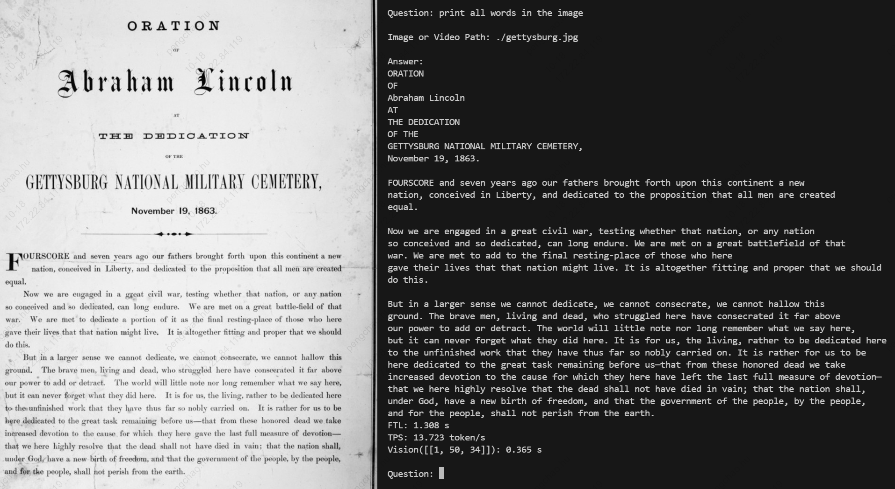

# Qwen3-VL

This project demonstrates deploying the multimodal large model [Qwen3-VL](https://www.modelscope.cn/models/Qwen/Qwen3-VL-4B-Instruct) on BM1684X/BM1688. The model is converted into a bmodel using the [TPU-MLIR](https://github.com/sophgo/tpu-mlir) compiler and deployed to a PCIE environment or an SoC environment.

This model can be used for image or video recognition, and demos are provided in both python and cpp versions.

This document covers how to compile the bmodel and how to run the bmodel in BM1684X/BM1688 environments. The bmodel compilation step can be skipped by downloading directly from the following links:

``` shell
# =============== 1684x =====================
# 1684x 2B, max 1K input, max_pixel 768x768, supports videos up to 12s (1 frame per second)
python3 -m dfss --url=open@sophgo.com:/ext_model_information/LLM/LLM-TPU/qwen3-vl-2b-instruct-w4a16_w4bf16_seq2048_bm1684x_1dev_dynamic_20260318_164243.bmodel
# 1684x 4B, max 1K input, max_pixel 768x768, supports videos up to 12s (1 frame per second)
python3 -m dfss --url=open@sophgo.com:/ext_model_information/LLM/LLM-TPU/qwen3-vl-4b-instruct-awq-4bit_w4bf16_seq2048_bm1684x_1dev_dynamic_20260318_165737.bmodel
# 1684x 8B, max 1K input, max_pixel 768x768, supports videos up to 12s (1 frame per second)
python3 -m dfss --url=open@sophgo.com:/ext_model_information/LLM/LLM-TPU/qwen3-vl-8b-instruct-4bit-gptq_w4bf16_seq2048_bm1684x_1dev_dynamic_20260318_165042.bmodel

# =============== 1688 ======================
# 1688 2B, max 1K input, max_pixel 768x768, supports videos up to 12s (1 frame per second)
python3 -m dfss --url=open@sophgo.com:/ext_model_information/LLM/LLM-TPU/qwen3-vl-2b-instruct-w4a16_w4bf16_seq2048_bm1688_2core_dynamic_20260318_170649.bmodel
# 1688 4B, max 1K input, max_pixel 768x768, supports videos up to 12s (1 frame per second)
python3 -m dfss --url=open@sophgo.com:/ext_model_information/LLM/LLM-TPU/qwen3-vl-4b-instruct-awq-4bit_w4bf16_seq2048_bm1688_2core_dynamic_20260318_170105.bmodel

```


## Compile the LLM model

This section describes how to compile the LLM into a bmodel.

#### 1. Download `Qwen3-VL-4B-Instruct` from ModelScope

(The file is large and will take a long time. Also, this model is not quantized and is for reference only. For better accuracy, please **download an AWQ or GPTQ quantized** version.)

``` shell
# Download the 4B model
modelscope download --model Qwen/Qwen3-VL-4B-Instruct --local_dir Qwen3-VL-4B-Instruct

# If you want to use the 8B model:
modelscope download --model Qwen/Qwen3-VL-8B-Instruct --local_dir Qwen3-VL-8B-Instruct
```

#### 2. Download docker and start the container

``` shell
docker pull sophgo/tpuc_dev:latest

# myname1234 is just an example, you can set your own name
docker run --privileged --name myname1234 -v $PWD:/workspace -it sophgo/tpuc_dev:latest
```
The following assumes that the environment is in the docker `/workspace` directory.

#### 2. Download the `TPU-MLIR` code and compile it

(You can also directly download and extract a prebuilt release package.)

``` shell
cd /workspace
git clone git@github.com:sophgo/tpu-mlir.git
cd tpu-mlir
source ./envsetup.sh  # activate environment variables
./build.sh # compile mlir
```

#### 3. Compile the model to generate the bmodel

``` shell
# If you get transformers/torch version issues, run pip3 install transformers torchvision -U
# Here max_input_length specifies the maximum input length; if not specified, it defaults to the length specified by -s
llm_convert.py -m /workspace/Qwen3-VL-4B-Instruct  -s 2048 --max_input_length 1024  --quantize w4bf16  -c bm1684x --out_dir qwen3vl_4b  --max_pixels 768,768 --dynamic
```
After compilation, `qwen3-vl-xxx.bmodel` and `config` are generated in the specified directory `qwen3vl_4b`.

## Compile and run the program (python)

* Environment preparation
> (This must be done before running python_demo.)
``` shell
# If it is not python3.10, refer to "FAQ" to configure the environment
pip3 install torchvision transformers qwen_vl_utils
```

Compile the library files to generate the `chat.cpython*.so` file, then copy it to the `pipeline.py` directory.

``` shell
cd python_demo
mkdir build 
cd build && cmake .. && make && cp *cpython* .. && cd ..

# run demo
python3 pipeline.py -m xxxx.bmodel -c config 
```
model is the actual model storage path; config_path is the configuration file path.

The running result is as follows:



## Compile and run the program (cpp)

``` shell
cd cpp_demo
mkdir build 
cd build && cmake .. && make && cp pipeline .. && cd ..

# run demo
./pipeline -m xxx.bmodel -c config
```

## Advanced usage

### 1. Support for historical context

By default, the model does not support historical context; the `--use_block_with_kv` parameter is required;
you need to specify the maximum input length `--max_input_length`; if not specified, it defaults to 1/4 of seq_length;
you need to specify the maximum input KV length `--max_prefill_kv_length`; if not specified, it defaults to seq_length.

As follows:
``` shell
# If you get transformers/torch version issues, run pip3 install transformers torchvision -U
llm_convert.py -m /workspace/Qwen3-VL-4B-Instruct -s 4096 --quantize w4bf16  -c bm1684x --out_dir qwen3vl_kv --max_pixels 768,768 --use_block_with_kv --max_input_length 1024
```
Both cpp_demo and python_demo support it. Type clear to clear the history.

### 2. Support for multi-batch (python)

By default, the model uses a single batch; multi-batch requires the `--batch` parameter.
You can directly download the precompiled model:
``` shell
python3 -m dfss --url=open@sophgo.com:/ext_model_information/LLM/LLM-TPU/qwen3-vl-2b-instruct-w4a16_w4bf16_seq768_bm1684x_1dev_4b_static_20260224_174219.bmodel
```
Or compile the model yourself:
``` shell
llm_convert.py -m /workspace/Qwen3-VL-2B-Instruct -s 768 --quantize w4bf16 -c bm1684x --out_dir qwen3vl_batch4 --max_pixels 768,768 --batch 4
```

Compile and run the program:
``` shell
cd python_demo_multibatch
mkdir build 
cd build && cmake .. && make && cp *cpython* .. && cd ..

# run demo
python3 pipeline.py -m xxxx.bmodel -c ../config 
```

## FAQ

#### How to configure a python3.10 environment on SoC?

The installation process is as follows:

``` shell
sudo add-apt-repository ppa:deadsnakes/ppa
sudo apt update
sudo apt install python3.10 python3.10-dev
```

Python virtual environment configuration:

``` shell
cd /data
# Create a virtual environment (without pip)
python3.10 -m venv --without-pip myenv

# Enter the virtual environment
source myenv/bin/activate

# Install pip manually
curl https://bootstrap.pypa.io/get-pip.py -o get-pip.py
python get-pip.py
rm get-pip.py

# Install dependency libraries
pip3 install torchvision pillow  transformers qwen_vl_utils -U

```

#### How many tokens does one image occupy?

Formula: $ tokens = height × width ÷ 32 ÷ 32 $
For example, a 768x768 image occupies 576 tokens.

#### How many tokens does a video occupy?

In this example, the video size defaults to 1/4 of the image size. For example, in the 768x768 case, the size 384x384 is used, which means every two frames (`temporal_patch_size`) occupy 144 tokens.

The default is 1 frame per second.

A 20-second video takes 20 frames, for a total of $ 144 × 20 ÷ 2 = 1440 $ tokens.

#### How to quantize the model?

You can use HuggingFace official quantization tools:

* [AutoAWQ](https://huggingface.co/docs/transformers/main/en/quantization/awq)

* [AutoGPTQ](https://huggingface.co/docs/transformers/main/en/quantization/gptq)

Here are some open-source quantized models available online:

* https://huggingface.co/kaitchup/Qwen3-VL-2B-Instruct-W4A16

* https://huggingface.co/cpatonn/Qwen3-VL-4B-Instruct-AWQ-4bit

* https://huggingface.co/aonaon/Qwen3-VL-8B-Instruct-4bit-GPTQ
