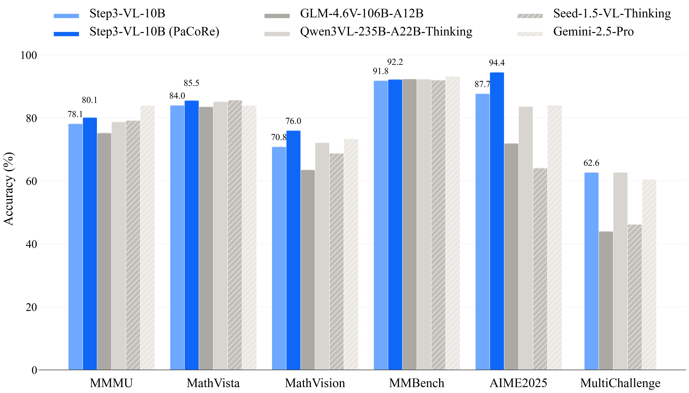

# Step3-VL-10B-AWQ
Base model: [stepfun-ai/Step3-VL-10B](https://www.modelscope.cn/models/stepfun-ai/Step3-VL-10B)

I added a small injection at the end of the original `chat_template.jinja` to support a GLM-like switch: you can try to disable the “thinking/reasoning” mode in your chat completion request via `"chat_template_kwargs": {"enable_thinking": False}`. 

Note that the model was not specifically trained with this switch, so it may not reliably follow it in all cases.

### 【Dependencies / Installation】

```python
vllm==0.14.0rc2
```

As of **2026-01-22**, make sure your system has cuda12.8 installed.

Then, create a fresh Python environment (e.g. python3.12 venv) and run:
```bash
pip install -U vllm --pre --index-url https://pypi.org/simple --extra-index-url https://wheels.vllm.ai/nightly
pip install git+https://github.com/huggingface/transformers.git
```

### 【vLLM Startup Command】

```
export VLLM_USE_DEEP_GEMM=0
export VLLM_USE_FLASHINFER_MOE_FP16=1
export VLLM_USE_FLASHINFER_SAMPLER=0
export OMP_NUM_THREADS=4

vllm serve \
    __YOUR_PATH__/tclf90/Step3-VL-10B-AWQ \
    --served-model-name MY_MODEL_NAME \
    --swap-space 4 \
    --max-model-len 32768 \
    --gpu-memory-utilization 0.9 \
    --tensor-parallel-size 1 \
    --enable-auto-tool-choice \
    --tool-call-parser hermes \
    --reasoning-parser glm45 \
    --trust-remote-code \
    --host 0.0.0.0 \
    --port 8000
```

### 【Logs】
```
2026-01-22
1. Initial commit
```

### 【Model Files】
| File Size | Last Updated |
|-----------|--------------|
| `8 GiB`   | `2026-01-22` |

### 【Model Download】
```python
from modelscope import snapshot_download
snapshot_download('tclf90/Step3-VL-10B-AWQ', cache_dir="your_local_path")
```

### 【Overview】

<div align="center">

<div align="center" style="display: flex; justify-content: center; align-items: center;">
  
  <h1 style="margin: 0; border-bottom: none;">STEP3-VL-10B</h1>
</div>

[](https://huggingface.co/collections/stepfun-ai/step3-vl-10b)
[](https://modelscope.cn/collections/stepfun-ai/Step3-VL-10B)
[](https://arxiv.org/abs/2601.09668)
[]()

</div>

## 📢 News & Updates

- 🚀 **Online Demo**: Explore Step3-VL-10B on [ModelScope Spaces](https://modelscope.cn/studios/stepfun-ai/step3-vl-10b) !
- 📢 **[Notice] vLLM Support:** vLLM integration is now officially supported! (PR [#32329](https://github.com/vllm-project/vllm/pull/32329))
- ✅ **[Fixed] HF Inference:** Resolved the `eos_token_id` misconfiguration in `config.json` that caused infinite generation loops. (PR [#f55c07e](https://modelscope.cn/models/stepfun-ai/Step3-VL-10B/files/f55c07eedaefd91854260c56ddfc8433073f344d))
- ✅ **[Fixing] Metric Correction:** We sincerely apologize for inaccuracies in the Qwen3VL-8B benchmarks (e.g., AIME, HMMT, LCB). The errors were caused by an incorrect max_tokens setting (mistakenly set to 32k) during our large-scale evaluation process. We are re-running the tests and will provide corrected numbers in the next version of technical report.

## 🚀 Introduction

**STEP3-VL-10B** is a lightweight open-source foundation model designed to redefine the trade-off between compact efficiency and frontier-level multimodal intelligence. Despite its compact **10B parameter footprint**, STEP3-VL-10B excels in **visual perception**, **complex reasoning**, and **human-centric alignment**. It consistently outperforms models under the 10B scale and rivals or surpasses significantly larger open-weights models (**10×–20× its size**), such as GLM-4.6V (106B-A12B), Qwen3-VL-Thinking (235B-A22B), and top-tier proprietary flagships like Gemini 2.5 Pro and Seed-1.5-VL.

<div align="center">

<p><i>Figure 1: Performance comparison of STEP3-VL-10B against SOTA multimodal foundation models. SeRe: Sequential Reasoning; PaCoRe: Parallel Coordinated Reasoning.</i></p>
</div>

The success of STEP3-VL-10B is driven by two key strategic designs:

1.  **Unified Pre-training on High-Quality Multimodal Corpus:** A single-stage, fully unfrozen training strategy on a 1.2T token multimodal corpus, focusing on two foundational capabilities: **reasoning** (e.g., general knowledge and education-centric tasks) and **perception** (e.g., grounding, counting, OCR, and GUI interactions). By jointly optimizing the Perception Encoder and the Qwen3-8B decoder, STEP3-VL-10B establishes intrinsic vision-language synergy.
2.  **Scaled Multimodal Reinforcement Learning and Parallel Reasoning:** Frontier capabilities are unlocked through a rigorous post-training pipeline comprising two-stage supervised finetuning (SFT) and **over 1,400 iterations of RL** with both verifiable rewards (RLVR) and human feedback (RLHF). Beyond sequential reasoning, we adopt **Parallel Coordinated Reasoning (PaCoRe)**, which allocates test-time compute to aggregate evidence from parallel visual exploration.

## 📥 Model Zoo

| Model Name            | Type |                            Hugging Face                            |                                ModelScope                                |
| :-------------------- | :--- | :----------------------------------------------------------------: | :----------------------------------------------------------------------: |
| **STEP3-VL-10B-Base** | Base | [🤗 Download](https://huggingface.co/stepfun-ai/Step3-VL-10B-Base) | [🤖 Download](https://modelscope.cn/models/stepfun-ai/Step3-VL-10B-Base) |
| **STEP3-VL-10B**      | Chat |   [🤗 Download](https://huggingface.co/stepfun-ai/Step3-VL-10B)    |   [🤖 Download](https://modelscope.cn/models/stepfun-ai/Step3-VL-10B)    |

## 📊 Performance

STEP3-VL-10B delivers best-in-class performance across major multimodal benchmarks, establishing a new performance standard for compact models. The results demonstrate that STEP3-VL-10B is the **most powerful open-source model in the 10B parameter class**.

### Comparison with Larger Models (10×–20× Larger)

| Benchmark         | STEP3-VL-10B (SeRe) | STEP3-VL-10B (PaCoRe) | GLM-4.6V (106B-A12B) | Qwen3-VL (235B-A22B) | Gemini-2.5-Pro | Seed-1.5-VL |
| :---------------- | :-----------------: | :-------------------: | :------------------: | :------------------: | :------------: | :---------: |
| **MMMU**          |        78.11        |         80.11         |        75.20         |        78.70         |   **83.89**    |    79.11    |
| **MathVista**     |        83.97        |         85.50         |        83.51         |        85.10         |     83.88      |  **85.60**  |
| **MathVision**    |        70.81        |       **75.95**       |        63.50         |        72.10         |     73.30      |    68.70    |
| **MMBench (EN)**  |        92.05        |         92.38         |        92.75         |        92.70         |   **93.19**    |    92.11    |
| **MMStar**        |        77.48        |         77.64         |        75.30         |        76.80         |   **79.18**    |    77.91    |
| **OCRBench**      |        86.75        |       **89.00**       |        86.20         |        87.30         |     85.90      |    85.20    |
| **AIME 2025**     |        87.66        |       **94.43**       |        71.88         |        83.59         |     83.96      |    64.06    |
| **HMMT 2025**     |        78.18        |       **92.14**       |        57.29         |        67.71         |     65.68      |    51.30    |
| **LiveCodeBench** |        75.77        |       **76.43**       |        48.71         |        69.45         |     72.01      |    57.10    |

<!-- > **Note:** **SeRe** (Sequential Reasoning) uses a max length of 64K tokens; **PaCoRe** (Parallel Coordinated Reasoning) synthesizes 16 SeRe rollouts with a max length of 128K tokens. -->

> **Note on Inference Modes:**
>
> **SeRe (Sequential Reasoning):** The standard inference mode using sequential generation (Chain-of-Thought) with a max length of 64K tokens.
>
> **PaCoRe (Parallel Coordinated Reasoning):** An advanced mode that scales test-time compute. It aggregates evidence from **16 parallel rollouts** to synthesize a final answer, utilizing a max context length of 128K tokens.
>
> _Unless otherwise stated, scores below refer to the standard SeRe mode. Higher scores achieved via PaCoRe are explicitly marked._

### Comparison with Open-Source Models (7B–10B)

| Category           | Benchmark        | STEP3-VL-10B | GLM-4.6V-Flash (9B) | Qwen3-VL-Thinking (8B) | InternVL-3.5 (8B) | MiMo-VL-RL-2508 (7B) |
| :----------------- | :--------------- | :----------: | :-----------------: | :--------------------: | :---------------: | :------------------: |
| **STEM Reasoning** | MMMU             |  **78.11**   |        71.17        |         73.53          |       71.69       |        71.14         |
|                    | MathVision       |  **70.81**   |        54.05        |         59.60          |       52.05       |        59.65         |
|                    | MathVista        |  **83.97**   |        82.85        |         78.50          |       76.78       |        79.86         |
|                    | PhyX             |  **59.45**   |        52.28        |         57.67          |       50.51       |        56.00         |
| **Recognition**    | MMBench (EN)     |  **92.05**   |        91.04        |         90.55          |       88.20       |        89.91         |
|                    | MMStar           |  **77.48**   |        74.26        |         73.58          |       69.83       |        72.93         |
|                    | ReMI             |  **67.29**   |        60.75        |         57.17          |       52.65       |        63.13         |
| **OCR & Document** | OCRBench         |  **86.75**   |        85.97        |         82.85          |       83.70       |        85.40         |
|                    | AI2D             |  **89.35**   |        88.93        |         83.32          |       82.34       |        84.96         |
| **GUI Grounding**  | ScreenSpot-V2    |    92.61     |        92.14        |       **93.60**        |       84.02       |        90.82         |
|                    | ScreenSpot-Pro   |  **51.55**   |        45.68        |         46.60          |       15.39       |        34.84         |
|                    | OSWorld-G        |  **59.02**   |        54.71        |         56.70          |       31.91       |        50.54         |
| **Spatial**        | BLINK            |  **66.79**   |        64.90        |         62.78          |       55.40       |        62.57         |
|                    | All-Angles-Bench |  **57.21**   |        53.24        |         45.88          |       45.29       |        51.62         |
| **Code**           | HumanEval-V      |  **66.05**   |        29.26        |         26.94          |       24.31       |        31.96         |

### Key Capabilities

- **STEM Reasoning:** Achieves **94.43%** on AIME 2025 and **75.95%** on MathVision (with PaCoRe), demonstrating exceptional complex reasoning capabilities that outperform models 10×–20× larger.
- **Visual Perception:** Records **92.05%** on MMBench and **80.11%** on MMMU, establishing strong general visual understanding and multimodal reasoning.
- **GUI & OCR:** Delivers state-of-the-art performance on ScreenSpot-V2 (**92.61%**), ScreenSpot-Pro (**51.55%**), and OCRBench (**86.75%**), optimized for agentic and document understanding tasks.
- **Spatial Understanding:** Demonstrates emergent spatial awareness with **66.79%** on BLINK and **57.21%** on All-Angles-Bench, establishing strong potential for embodied intelligence applications.

## 🏗️ Architecture & Training

### Architecture

- **Visual Encoder:** PE-lang (Language-Optimized Perception Encoder), 1.8B parameters.
- **Decoder:** Qwen3-8B.
- **Projector:** Two consecutive stride-2 layers (resulting in 16× spatial downsampling).
- **Resolution:** Multi-crop strategy consisting of a 728×728 global view and multiple 504×504 local crops.

### Training Pipeline

- **Pre-training:** Single-stage, fully unfrozen strategy using AdamW optimizer (Total: 1.2T tokens, 370K iterations).
  - Phase 1: 900B tokens.
  - Phase 2: 300B tokens.
- **Supervised Finetuning (SFT):** Two-stage approach (Total: ~226B tokens).
  - Stage 1: 9:1 text-to-multimodal ratio (~190B tokens).
  - Stage 2: 1:1 text-to-multimodal ratio (~36B tokens).
- **Reinforcement Learning:** Total >1,400 iterations.
  - **RLVR:** 600 iterations (Tasks: mathematics, geometry, physics, perception, grounding).
  - **RLHF:** 300 iterations (Task: open-ended generation).
  - **PaCoRe Training:** 500 iterations (Context length: 64K max sequence).

## 🛠️ Quick Start

### Inference with Hugging Face Transformers

We introduce how to use our model at inference stage using transformers library. It is recommended to use python=3.10, torch>=2.1.0, and transformers=4.57.0 as the development environment.We currently only support bf16 inference, and multi-patch for image preprocessing is supported by default. This behavior is aligned with vllm.

**Note:** If you experience infinite generation issues, please check [Discussion #9](https://huggingface.co/stepfun-ai/Step3-VL-10B/discussions/9) for the fix.

```python
from transformers import AutoProcessor, AutoModelForCausalLM


key_mapping = {
    "^vision_model": "model.vision_model",
    r"^model(?!\.(language_model|vision_model))": "model.language_model",
    "vit_large_projector": "model.vit_large_projector",
}

model_path = "stepfun-ai/Step3-VL-10B"

processor = AutoProcessor.from_pretrained(model_path, trust_remote_code=True)

messages = [
    {
        "role": "user",
        "content": [
            {"type": "image", "url": "https://huggingface.co/datasets/huggingface/documentation-images/resolve/main/bee.jpg"},
            {"type": "text", "text": "What's in this picture?"}
        ]
    },
]

model = AutoModelForCausalLM.from_pretrained(
    model_path,
    trust_remote_code=True,
    device_map="auto",
    torch_dtype="auto",
    key_mapping=key_mapping).eval()


inputs = processor.apply_chat_template(
    messages, add_generation_prompt=True, tokenize=True,
    return_dict=True, return_tensors="pt"
).to(model.device)


generate_ids = model.generate(**inputs, max_new_tokens=1024, do_sample=False)
decoded = processor.decode(generate_ids[0, inputs["input_ids"].shape[-1] :], skip_special_tokens=True)

print(decoded)
```

## 🚀 Deployment with vLLM (OpenAI-compatible API)

For deployment, you can use vllm to create an OpenAI-compatible API endpoint.

1. Install vLLM nightly (choose one):

   - **Python / pip**

     ```bash
     pip install vllm --pre --extra-index-url https://wheels.vllm.ai/nightly
     ```

     Python ≥3.10 is required. Please ensure vLLM version >= 0.14.0rc2.dev143+gc0a350ca7.

   - **Docker (nightly image)**

     ```bash
     docker pull vllm/vllm-openai:nightly-963dc0b865a3b6011fde7e0d938f86245dccbfac
     ```

     The tag above pins the nightly build we validated; update to the latest nightly tag if needed.

2. Launch the server:

   ```bash
   vllm serve --model stepfun-ai/Step3-VL-10B -tp 1 --reasoning-parser deepseek_r1 --enable-auto-tool-choice --tool-call-parser hermes --trust-remote-code
   ```

   **Crucial Step:**
   You must append the --trust-remote-code flag to your deployment command. This is mandatory for models that utilize custom code for their architecture.

3. Call the endpoint using any OpenAI-compatible SDK (example in Python):

   ```python
   from openai import OpenAI

   client = OpenAI(base_url="http://localhost:8000/v1", api_key="dummy")

   resp = client.chat.completions.create(
       model="stepfun-ai/Step3-VL-10B",
       messages=[{
           "role":
           "user",
           "content": [{
               "type": "image_url",
               "image_url": {
                   "url":
                   "https://huggingface.co/datasets/huggingface/documentation-images/resolve/main/bee.jpg"
               }
           }, {
               "type": "text",
               "text": "what's in this picture?"
           }]
       }])

   print(resp.choices[0].message.content)


   ```

## 📜 Citation

If you find this project useful in your research, please cite our technical report:

```tex
@misc{huang2026step3vl10btechnicalreport,
      title={STEP3-VL-10B Technical Report},
      author={Ailin Huang and Chengyuan Yao and Chunrui Han and Fanqi Wan and Hangyu Guo and Haoran Lv and Hongyu Zhou and Jia Wang and Jian Zhou and Jianjian Sun and Jingcheng Hu and Kangheng Lin and Liang Zhao and Mitt Huang and Song Yuan and Wenwen Qu and Xiangfeng Wang and Yanlin Lai and Yingxiu Zhao and Yinmin Zhang and Yukang Shi and Yuyang Chen and Zejia Weng and Ziyang Meng and Ang Li and Aobo Kong and Bo Dong and Changyi Wan and David Wang and Di Qi and Dingming Li and En Yu and Guopeng Li and Haiquan Yin and Han Zhou and Hanshan Zhang and Haolong Yan and Hebin Zhou and Hongbo Peng and Jiaran Zhang and Jiashu Lv and Jiayi Fu and Jie Cheng and Jie Zhou and Jisheng Yin and Jingjing Xie and Jingwei Wu and Jun Zhang and Junfeng Liu and Kaijun Tan and Kaiwen Yan and Liangyu Chen and Lina Chen and Mingliang Li and Qian Zhao and Quan Sun and Shaoliang Pang and Shengjie Fan and Shijie Shang and Siyuan Zhang and Tianhao You and Wei Ji and Wuxun Xie and Xiaobo Yang and Xiaojie Hou and Xiaoran Jiao and Xiaoxiao Ren and Xiangwen Kong and Xin Huang and Xin Wu and Xing Chen and Xinran Wang and Xuelin Zhang and Yana Wei and Yang Li and Yanming Xu and Yeqing Shen and Yuang Peng and Yue Peng and Yu Zhou and Yusheng Li and Yuxiang Yang and Yuyang Zhang and Zhe Xie and Zhewei Huang and Zhenyi Lu and Zhimin Fan and Zihui Cheng and Daxin Jiang and Qi Han and Xiangyu Zhang and Yibo Zhu and Zheng Ge},
      year={2026},
      eprint={2601.09668},
      archivePrefix={arXiv},
      primaryClass={cs.CV},
      url={https://arxiv.org/abs/2601.09668},
}
```

## 📄 License

This project is open-sourced under the [Apache 2.0 License](https://www.google.com/search?q=LICENSE).
