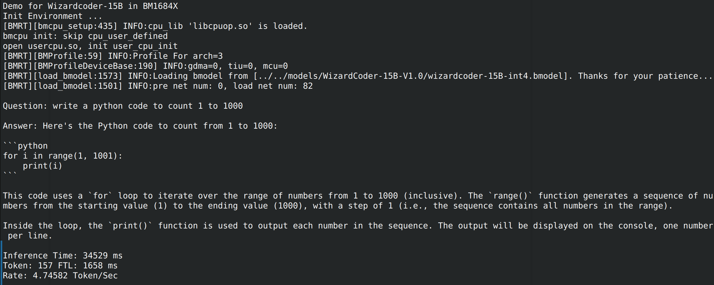

# Wizardcoder-TPU

This project deploys the large language model [Wizardcoder-15B](https://huggingface.co/WizardLM/WizardCoder-15B-V1.0) on BM1684X. The model is converted to bmodel using the [TPU-MLIR](https://github.com/sophgo/tpu-mlir) compiler, and deployed to the BM1684X in a PCIE environment or an SoC environment using C++ code.

## Directory Structure

```
.
├── assets
│   ├── sophgo_chip.png
│   └── wizardcoder.png
├── compile                                                ## scripts required for model export and conversion
│   ├── compile.sh
│   ├── export_to_onnx.py
│   └── modeling_gpt_bigcode.py
├── demo                                                   ## model runtime code
│   ├── CMakeLists.txt
│   ├── demo.cpp
│   ├── gpt2tokenizer.cc
│   ├── include
│   │   └── tokenizer.h
│   ├── lib_pcie                                            ## runtime required for the PCIE environment
│   │   ├── include
│   │   │   ├── bmdef.h
│   │   │   ├── bmlib_runtime.h
│   │   │   └── bmruntime_interface.h
│   │   └── lib
│   │       ├── libbmlib.so
│   │       ├── libbmrt.so
│   │       └── libbmrt.so.1.0
│   └── lib_soc                                             ## runtime required for the SOC environment
│       ├── include
│       │   ├── bmdef.h
│       │   ├── bmlib_runtime.h
│       │   └── bmruntime_interface.h
│       └── lib
│           ├── libbmlib.so
│           ├── libbmrt.so
│           └── libbmrt.so.1.0
├── Readme.md
└── vocab
    ├── merges.txt
    └── vocab.json


```

## Build


### Requirements

- A gcc or clang compiler supporting the C++17 standard
- If you do not use the libsophon in ```demo/libsophon_pcie``` or need a specific version of libsophon, you need to specify ```LIBSOPHON_DIR``` when compiling below
- The converted Wizardcoder-15B.bmodel file

## Development Environment Preparation

### 1. Download the model (taking `Wizardcoder-15B-V1.0` as an example)

``` shell
git lfs install
git clone https://huggingface.co/WizardLM/WizardCoder-15B-V1.0
```

This repository is quite large and will take a long time.


### 2. Download docker and start the container

``` shell
docker pull sophgo/tpuc_dev:latest

# myname1234 is just an example, you can set your own name
docker run --privileged --name myname1234 -v $PWD:/workspace -it sophgo/tpuc_dev:latest
```
The following text assumes that everything is done inside docker


### 3. Download this project `Wizardcoder-TPU`

Download this project and export all the ONNX files (you need to replace the corresponding file under the `transformers` folder with the `modeling_gpt_bigcode.py` file under the `compile` path of this project; detailed steps are as follows:

#### Clone this project
``` shell
git clone https://github.com/enigma9981/Wizardcoder-TPU
cd Wizardcoder-TPU
```

#### Modify the model files
- Install the required dependencies: use `pip install -r requirements.txt` to install the required dependencies
- Use ```pip show transformers``` to find the location of ```transformers```, e.g. `/usr/local/lib/python3.10/dist-packages` (this may differ across Python versions and systems)
- Use the provided ```compile/modeling_gpt_bigcode.py``` to replace the file with the same name under the location found above: ```/usr/local/lib/python3.10/dist-packages/transformers/models/gpt_bigcode/```

Example:

```shell
cd Wizardcoder-TPU
pip show transformers
cp compile/modeling_gpt_bigcode.py /usr/local/lib/python3.10/dist-packages/transformers/models/gpt_bigcode/
```
- PS: **The path is not necessarily /usr/local/lib/python3.10/dist-packages/transformers/models/gpt_bigcode/modeling_gpt_bigcode.py; it is recommended to run pip show transformers to check before replacing**
- After finishing the model file modification, to verify whether the environment is set up correctly, you can refer to the later section: FAQ - Debugging is needed when converting the model

#### Export the ONNX format model
```shell
python export_to_onnx.py --model_path your_model_path
```
- your_model_path refers to the path where the original model was downloaded, e.g. "../../WizardCoder-15B-V1.0/"
- The default length MAX_LEN is 512; if you need to change it, use the `--max_length length_you_want` parameter
- After the script finishes, a large number of ONNX models will be generated under ```./tmp/``` for subsequent conversion on the TPU


### 4. Download the `TPU-MLIR` code and compile it

(You can also directly download the pre-compiled release package and extract it)

``` shell
git clone git@github.com:sophgo/tpu-mlir.git
cd tpu-mlir
source ./envsetup.sh
./build.sh
```

## Compile the Model

Note that you should now be in the workspace directory of the Docker environment.

### Register the required environment variables
- Find and enter the `tpu-mlir` installation directory after compilation or extraction is complete
- Run `source ./envsetup.sh`
This registers the required environment variables
### Start model conversion

Under the `Wizardcoder-TPU/compile` directory, run:
```shell
./compile.sh --mode int4
```
Wait a moment and the INT4-quantized bmodel file will be exported

- Due to TPU memory limitations, ```./compile.sh``` currently only supports INT4 quantization on a single chip; after running ```./compile.sh --mode int4```, the ```wizardcoder-15B_int4.bmodel``` file will be generated in the directory
- Generating the bmodel takes roughly 3 hours or more; 64 GB of memory and more than 300 GB of disk space are recommended, otherwise OOM or "no space left" is very likely

## Compile the Program (C++)

### PCIE version
Run the following compilation (note that for the SoC version, you need to copy the demo directory to the SoC environment to compile):

```shell
cd Wizardcoder-TPU/demo
mkdir build
cd build
cmake ..
make
```

### SOC version (compile on the SOC device)
```shell
cd Wizardcoder-TPU/demo
mkdir build
cd build
cmake ..
make
```
- The program automatically detects the architecture of the compilation environment and automatically links the relevant runtime, so the compilation code is the same
- The compilation generates the `wizardcoder` executable.
- To ensure the model runs properly, do not move the `vocab` directory or its contents after compilation

After completing the compilation process above, the ```demo/build/wizardcoder``` executable is generated, which can load the bmodel and perform inference on a ```BM1684X``` device. Example:

```shell
demo/build/wizardcoder -m /path/to/bmodel -d 0
```

- -m specifies the location of the bmodel
- -d specifies the chip used for inference; the default id is 0. If you need to run inference on multiple chips, separate them with commas, e.g. -d 0,1,2,3

Example:
```shell
./wizardcoder -m ../../../models/WizardCoder-15B-V1.0/test/wizardcoder-15B-int4_rc1.bmodel -v ../vocab/vocab.json -d 0
```
The actual paths should match your local situation.

## Running Results

The following shows the running results in INT4 quantization mode on a single chip:



## FAQ

### The demo program cannot run properly

If the demo program fails to run after being copied to the runtime environment, e.g. errors such as missing interfaces.
The reason is that the libraries in the runtime environment differ. Copy the .so files from `lib_pcie` (PCIE) or `lib_soc` (SoC) in the demo to the runtime environment and link against those .so files.
### Debugging is needed when converting the model
- To verify whether the python environment works properly, you can use the `net_test_fixed_length` function in `export_to_onnx.py` for testing
- If you want to debug instead of generating all the onnx models at once, you can change num_layers on line 36 of `export_to_onnx.py` to 1, and use the function on line 144 to compare whether a single block aligns with the pytorch version


### Running inference on multiple chips

Multi-chip inference will be supported later. Please use ```./compile.sh --mode [F16/int8/int4] --num_device [2/4/8]``` for conversion; after compilation, a model file named wizardcoder-15B_{X}_{Y}dev.bmodel will be generated under the compile path, where X represents the quantization method (F16/int8/int4, etc.) and Y represents the number of chips used (1/2/4/8, etc.).

### What modifications did Wizardcoder-TPU make

Only partial adjustments were made to `modeling_gpt_bigcode.py`.


#### 1. Adjustments to the code in `modeling_gpt_bigcode.py`

1) The modification is as follows (this is because converting TORCH2 operators to ONNX fails):

    ``` python
    sdpa_result = _scaled_dot_product_attention(
            query,
            key,
            value,
            attn_mask=attention_mask,
            dropout_p=self.attn_pdrop if self.training else 0.0,
            # The query_length > 1 is necessary to match with AttentionMaskConverter.to_causal_4d that does not create a causal mask in case query_length == 1.
            is_causal=self.is_causal and attention_mask is None and query_length > 1,
            scale=scale,
        )
    ```
    Around line 560, `F.scaled_dot_product_attention` is replaced with a custom implementation:
    ```python
    def _scaled_dot_product_attention(query, key, value, attn_mask=None, dropout_p=0.0, is_causal=False, scale=None) -> torch.Tensor:
        L, S = query.size(-2), key.size(-2)
        scale_factor = 1 / math.sqrt(query.size(-1)) if scale is None else scale
        attn_bias = torch.zeros(L, S, dtype=query.dtype)
        if is_causal:
            assert attn_mask is None
            temp_mask = torch.ones(L, S, dtype=torch.bool).tril(diagonal=0)
            attn_bias.masked_fill_(temp_mask.logical_not(), float("-inf"))
            attn_bias.to(query.dtype)

        if attn_mask is not None:
            attn_bias = attn_mask
        
        attn_weight = query @ key.transpose(-2, -1) * scale_factor
        attn_weight += attn_bias
        attn_weight = torch.softmax(attn_weight, dim=-1)
        return attn_weight @ value
    
    ```
2) The modification is as follows
    ```python
    # self.attn = GPTBIGCODE_ATTENTION_CLASSES[config._attn_implementation](config, layer_idx=layer_idx)
    self.attn = GPTBigCodeSdpaAttention(config, layer_idx=layer_idx)
    ```
    Around line 673, GPTBigCodeSdpaAttention is forcibly used to simplify the computation
